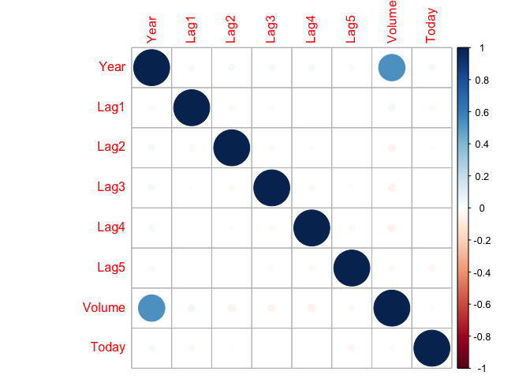

Logistic\_Regression
================
Jay
2020 2 8

-   Response가 qualitative일 때 Logistic Regression Model을 적합해본다.
-   Train - Test set을 나눠 예측력을 확인한다.
-   사용한 데이터는 "ILSR" 패키지의 "Smarket"데이터. S&P500 주가 시계열 데이터이다
-   과거 주가 이용해 주가가 오를지 내릴지 여부(Direction) 예측

``` r
rm(list=ls())
library(ISLR); library(corrplot); library(ggplot2)
```

    ## corrplot 0.84 loaded

### Data Glance

``` r
Smarket = ISLR::Smarket
names(Smarket)
```

    ## [1] "Year"      "Lag1"      "Lag2"      "Lag3"      "Lag4"      "Lag5"     
    ## [7] "Volume"    "Today"     "Direction"

``` r
dim(Smarket)
```

    ## [1] 1250    9

``` r
head(Smarket)
```

    ##   Year   Lag1   Lag2   Lag3   Lag4   Lag5 Volume  Today Direction
    ## 1 2001  0.381 -0.192 -2.624 -1.055  5.010 1.1913  0.959        Up
    ## 2 2001  0.959  0.381 -0.192 -2.624 -1.055 1.2965  1.032        Up
    ## 3 2001  1.032  0.959  0.381 -0.192 -2.624 1.4112 -0.623      Down
    ## 4 2001 -0.623  1.032  0.959  0.381 -0.192 1.2760  0.614        Up
    ## 5 2001  0.614 -0.623  1.032  0.959  0.381 1.2057  0.213        Up
    ## 6 2001  0.213  0.614 -0.623  1.032  0.959 1.3491  1.392        Up

``` r
summary(Smarket)
```

    ##       Year           Lag1                Lag2                Lag3          
    ##  Min.   :2001   Min.   :-4.922000   Min.   :-4.922000   Min.   :-4.922000  
    ##  1st Qu.:2002   1st Qu.:-0.639500   1st Qu.:-0.639500   1st Qu.:-0.640000  
    ##  Median :2003   Median : 0.039000   Median : 0.039000   Median : 0.038500  
    ##  Mean   :2003   Mean   : 0.003834   Mean   : 0.003919   Mean   : 0.001716  
    ##  3rd Qu.:2004   3rd Qu.: 0.596750   3rd Qu.: 0.596750   3rd Qu.: 0.596750  
    ##  Max.   :2005   Max.   : 5.733000   Max.   : 5.733000   Max.   : 5.733000  
    ##       Lag4                Lag5              Volume           Today          
    ##  Min.   :-4.922000   Min.   :-4.92200   Min.   :0.3561   Min.   :-4.922000  
    ##  1st Qu.:-0.640000   1st Qu.:-0.64000   1st Qu.:1.2574   1st Qu.:-0.639500  
    ##  Median : 0.038500   Median : 0.03850   Median :1.4229   Median : 0.038500  
    ##  Mean   : 0.001636   Mean   : 0.00561   Mean   :1.4783   Mean   : 0.003138  
    ##  3rd Qu.: 0.596750   3rd Qu.: 0.59700   3rd Qu.:1.6417   3rd Qu.: 0.596750  
    ##  Max.   : 5.733000   Max.   : 5.73300   Max.   :3.1525   Max.   : 5.733000  
    ##  Direction 
    ##  Down:602  
    ##  Up  :648  
    ##            
    ##            
    ##            
    ## 

``` r
corrplot(cor(Smarket[,-9]))
```



``` r
attach(Smarket)
```

### Logistic Regression fitting

``` r
glm_fit =glm(Direction ~ Lag1 + Lag2 + Lag3 + Lag4 + Lag5 + Volume , 
             data=Smarket, family=binomial)
summary(glm_fit)
```

    ## 
    ## Call:
    ## glm(formula = Direction ~ Lag1 + Lag2 + Lag3 + Lag4 + Lag5 + 
    ##     Volume, family = binomial, data = Smarket)
    ## 
    ## Deviance Residuals: 
    ##    Min      1Q  Median      3Q     Max  
    ## -1.446  -1.203   1.065   1.145   1.326  
    ## 
    ## Coefficients:
    ##              Estimate Std. Error z value Pr(>|z|)
    ## (Intercept) -0.126000   0.240736  -0.523    0.601
    ## Lag1        -0.073074   0.050167  -1.457    0.145
    ## Lag2        -0.042301   0.050086  -0.845    0.398
    ## Lag3         0.011085   0.049939   0.222    0.824
    ## Lag4         0.009359   0.049974   0.187    0.851
    ## Lag5         0.010313   0.049511   0.208    0.835
    ## Volume       0.135441   0.158360   0.855    0.392
    ## 
    ## (Dispersion parameter for binomial family taken to be 1)
    ## 
    ##     Null deviance: 1731.2  on 1249  degrees of freedom
    ## Residual deviance: 1727.6  on 1243  degrees of freedom
    ## AIC: 1741.6
    ## 
    ## Number of Fisher Scoring iterations: 3

``` r
contrasts(Direction)
```

    ##      Up
    ## Down  0
    ## Up    1

#### fitting된 Model의 예측 확률값 도출

type="response" argument로 logit 값이 아닌 확률값 산출

``` r
glm_probs = predict(glm_fit, type="response")
glm_probs[1:10]
```

    ##         1         2         3         4         5         6         7         8 
    ## 0.5070841 0.4814679 0.4811388 0.5152224 0.5107812 0.5069565 0.4926509 0.5092292 
    ##         9        10 
    ## 0.5176135 0.4888378

#### 확률값 기준으로 Response(Direction) 예측

Accuracy 측정

``` r
glm_pred = rep("Down",nrow(Smarket))
glm_pred[glm_probs>0.5] = "UP"

glm_tab = table(glm_pred, Direction)
glm_tab
```

    ##         Direction
    ## glm_pred Down  Up
    ##     Down  145 141
    ##     UP    457 507

``` r
sum(diag(glm_tab))/sum(glm_tab)
```

    ## [1] 0.5216

``` r
mean(glm_pred==Direction)
```

    ## [1] 0.116

Train - Test Split
==================

``` r
train = (Year<2005)
Smarket_2005 = Smarket[!train,]
dim(Smarket_2005)
```

    ## [1] 252   9

``` r
Direction_2005 = Direction[!train]
```

### Logistic Regression fitting

``` r
glm_tr_fit = glm(Direction ~ Lag1+Lag2+Lag3+Lag4+Lag5+Volume,
                 data=Smarket, family=binomial, subset=train)
summary(glm_tr_fit)
```

    ## 
    ## Call:
    ## glm(formula = Direction ~ Lag1 + Lag2 + Lag3 + Lag4 + Lag5 + 
    ##     Volume, family = binomial, data = Smarket, subset = train)
    ## 
    ## Deviance Residuals: 
    ##    Min      1Q  Median      3Q     Max  
    ## -1.302  -1.190   1.079   1.160   1.350  
    ## 
    ## Coefficients:
    ##              Estimate Std. Error z value Pr(>|z|)
    ## (Intercept)  0.191213   0.333690   0.573    0.567
    ## Lag1        -0.054178   0.051785  -1.046    0.295
    ## Lag2        -0.045805   0.051797  -0.884    0.377
    ## Lag3         0.007200   0.051644   0.139    0.889
    ## Lag4         0.006441   0.051706   0.125    0.901
    ## Lag5        -0.004223   0.051138  -0.083    0.934
    ## Volume      -0.116257   0.239618  -0.485    0.628
    ## 
    ## (Dispersion parameter for binomial family taken to be 1)
    ## 
    ##     Null deviance: 1383.3  on 997  degrees of freedom
    ## Residual deviance: 1381.1  on 991  degrees of freedom
    ## AIC: 1395.1
    ## 
    ## Number of Fisher Scoring iterations: 3

#### 학습된 Model로 Test-set 예측 & Accuracy 확인

``` r
glm_ts_probs = predict(glm_tr_fit, Smarket_2005, type="response")

glm_ts_pred = rep("Down",252)
glm_ts_pred[glm_ts_probs>0.5] = "Up"
glm_ts_tab = table(glm_ts_pred, Direction_2005)
sum(diag(glm_ts_tab))/sum(glm_ts_tab)
```

    ## [1] 0.4801587

``` r
mean(glm_ts_pred==Direction_2005)
```

    ## [1] 0.4801587

``` r
mean(glm_ts_pred!=Direction_2005)
```

    ## [1] 0.5198413

#### 변수선택(according to P-value) 후 Logistic Model fitting & Accuracy 확인

``` r
glm_fit = glm(Direction~Lag1+Lag2,
              data=Smarket, family=binomial, subset=train)
glm_probs = predict(glm_fit, Smarket_2005, type="response")
glm_pred = rep("Down",252)
glm_pred[glm_probs>0.5]="Up"
glm_tab = table(glm_pred,Direction_2005)
glm_tab
```

    ##         Direction_2005
    ## glm_pred Down  Up
    ##     Down   35  35
    ##     Up     76 106

``` r
sum(diag(glm_tab))/sum(glm_tab)
```

    ## [1] 0.5595238

``` r
mean(glm_pred==Direction_2005)
```

    ## [1] 0.5595238

``` r
mean(glm_pred!=Direction_2005)
```

    ## [1] 0.4404762

#### New data 예측할 시 Example

``` r
predict(glm_fit, newdata=data.frame(Lag1=c(1.2,1.5),Lag2=c(1.1,-0.8)),type='response')
```

    ##         1         2 
    ## 0.4791462 0.4960939
