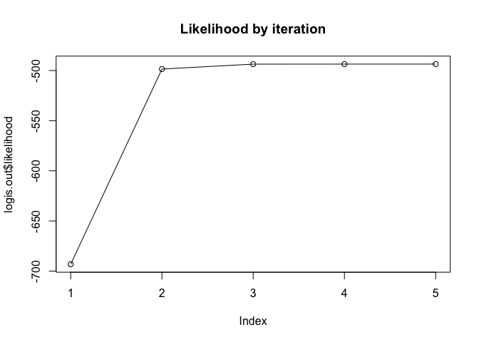
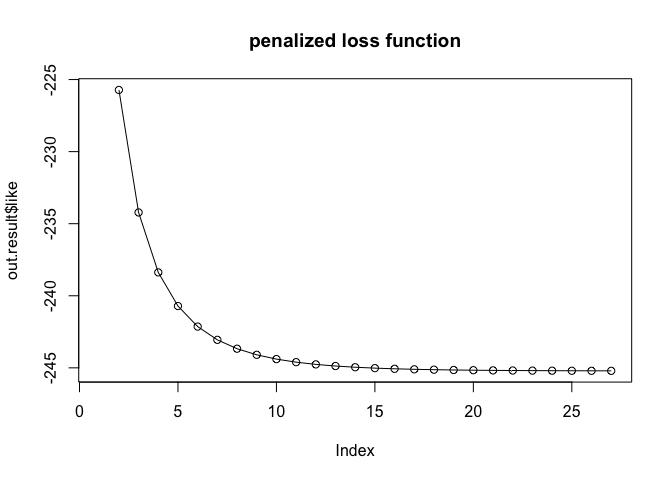
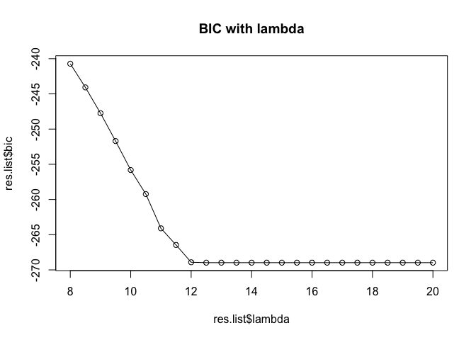

Logit\_Out\_Detect
================

**Outlier detection**
=====================

**1. Logistic regression**
--------------------------

### **1) Simulation data**

``` r
n=1000
p=10
x.mat=matrix(runif(n*p),ncol=p)
b.vec=1/(1:p)
xb.vec=drop(x.mat %*% b.vec)
p.vec=exp(xb.vec)/(1+exp(xb.vec))
y.vec=rbinom(n,1,p.vec)
```

### **2) Likelihood-Gradient-Hessian**

-   Loglikelihood Function

``` r
like.fun=function(y.vec,x.mat,b.vec){
  xb.vec=x.mat %*% b.vec
  p.vec=exp(xb.vec)/(1+exp(xb.vec))
  like=sum(y.vec*log(p.vec)+(1-y.vec)*log(1-p.vec))
  return(like)
}
```

-   Gradient: first-derivatives of log-likelihood

``` r
first.dev.fun=function(y.vec,x.mat,b.vec){
  xb.vec=x.mat %*% b.vec
  p.vec=exp(xb.vec)/(1+exp(xb.vec))
  grad=-(t(x.mat) %*% (y.vec-p.vec))
  return(grad)
}
```

-   Hessian: second-derivatives of log-likelihood

``` r
sec.dev.fun=function(x.mat,b.vec){
  xb.vec=x.mat %*% b.vec
  p.vec=drop(exp(xb.vec)/(1+exp(xb.vec)))
  hess = t(x.mat) %*% diag(p.vec*(1-p.vec)) %*% x.mat
  return(hess)
}
```

### **3) Logistic regression**

-   Newton-Raphson method

``` r
logis.fun=function(y.vec,x.mat,iter.max=1000,eps=1e-6,iter.print=F){
  b.vec=rep(0,ncol(x.mat))
  like.val=NULL
  for (iter in 1:iter.max){
    bef.b.vec=b.vec
    like.val[iter]=like.fun(y.vec,x.mat,bef.b.vec)
    if (iter.print==T){print(paste0("iteration : ",iter," / LL: ",like.val[iter]))}
    fst.dev.val=first.dev.fun(y.vec,x.mat,bef.b.vec)
    sec.dev.val=sec.dev.fun(x.mat,bef.b.vec)
    b.vec=bef.b.vec-(solve(sec.dev.val) %*% fst.dev.val)
    
    if(like.fun(y.vec,x.mat,b.vec)-like.val[iter]<eps){break}
  }
  if (iter.print==T){list(likelihood=like.val,coefs=b.vec)} else{return(drop(b.vec))}
}
```

-   Run

``` r
logis.out=logis.fun(y.vec,x.mat,iter.print = T)
```

    ## [1] "iteration : 1 / LL: -693.147180559945"
    ## [1] "iteration : 2 / LL: -502.276724759812"
    ## [1] "iteration : 3 / LL: -496.866214822904"
    ## [1] "iteration : 4 / LL: -496.802109112767"
    ## [1] "iteration : 5 / LL: -496.802094277469"

``` r
plot(logis.out$likelihood,type="o",main="Likelihood by iteration")
```



``` r
logis.out$coefs
```

    ##              [,1]
    ##  [1,]  1.40660990
    ##  [2,]  0.61141684
    ##  [3,]  0.40170433
    ##  [4,] -0.03484373
    ##  [5,]  0.47110349
    ##  [6,]  0.29492321
    ##  [7,] -0.28049938
    ##  [8,]  0.13215914
    ##  [9,]  0.18368525
    ## [10,] -0.37165576

-   Compare with glm() function

``` r
xy.dat=as.data.frame(cbind(y.vec,x.mat))
coef(glm(y.vec~.-1,data=xy.dat,family="binomial"))
```

    ##          V2          V3          V4          V5          V6          V7 
    ##  1.40660990  0.61141684  0.40170433 -0.03484373  0.47110349  0.29492321 
    ##          V8          V9         V10         V11 
    ## -0.28049938  0.13215914  0.18368525 -0.37165576

**2. Outlier Detection(GPOD)**
------------------------------

### **1) Simulation data**

``` r
library(Matrix)
n=20
m=20

x.mat=cbind(rep(1,n*m))
b.vec=c(1)
design.z=list()
for (j in 1:m){
  design.z[[j]]=rep(1,n)
}
z.mat=as.matrix(.bdiag(design.z))
del.vec=c(rep(0,17),rep(-3,3))

grp.index=NULL
for (i in 1:m){
  grp.index=c(grp.index,rep(i,n))
}

set.seed(12345)
exp.vec=exp(x.mat %*% b.vec+z.mat %*% del.vec)
p.vec=exp.vec/(1+exp.vec)
y.vec=rbinom(n*m,1,p.vec)
```

### **2) penalized-likelihood**

``` r
pen.like.fun=function(y.vec,x.mat,z.mat,b.vec,del.vec,lambda){
  p=ncol(x.mat)
  xb.vec=x.mat %*% b.vec
  zdel.vec=z.mat %*% del.vec
  p.vec=exp(xb.vec+zdel.vec)/(1+exp(xb.vec+zdel.vec))
  pen=lambda*sqrt(t(del.vec) %*% diag(rep(p,m)) %*% del.vec)
  lik=sum(y.vec*log(p.vec)+(1-y.vec)*log(1-p.vec))
  like=lik+pen
  return(like)
}
```

### **3) Group-type Penalized Outlier Detection(GPOD)**

``` r
logis.outlier.func=function(y.vec,x.mat,z.mat,grp.index,lambda,iter.max=1000,eps=10^-4,view.iter=F){
  require(Matrix)
  p=ncol(x.mat)  
  
  ### step 1. median b0hat  
  b.vec.est=NULL
  like=NULL
  for (i in 1:m){
    b.vec.est[i]=logis.fun(y.vec[which(grp.index==i)],as.matrix(x.mat[which(grp.index==i),]))
  }
  b.est=median(b.vec.est)
  exp.vec=exp(x.mat %*% b.est+z.mat %*% c(b.vec.est-b.est))
  p.vec=exp.vec/(1+exp.vec)
  #####3 step 2. original delta
  ## w.mat 
  p.grp.list=list()
  for (j in 1:m){
    p.grp.list[[j]]=diag(p.vec[which(grp.index==j)]*(1-p.vec[which(grp.index==j)]))
  }
  w.mat=as.matrix(.bdiag(p.grp.list))
  ## q value
  q.vec=log(p.vec/(1-p.vec))-z.mat %*% rep(b.est,m)+solve(w.mat) %*% (y.vec-p.vec)
  ## original delta
  del.0=solve(t(z.mat) %*% w.mat %*% z.mat) %*% t(z.mat) %*% w.mat %*% q.vec
  old.del.up=del.0
  #iter=2
  for (iter in 1:iter.max){
    if(iter>1){
      like[iter]=pen.like.fun(y.vec,x.mat,z.mat,b.est,del.vec=old.del.up,lambda=lambda)
      if(view.iter==T){print(paste0("iter: ",iter," / ","penalized-like: ",like[iter]))}
    }
    exp.vec.2=exp(x.mat %*% b.est+z.mat %*% old.del.up)
    p.vec.2=exp.vec.2/(1+exp.vec.2)
    ## lamb.mat
    lamb.mat=lambda*sqrt(p)*diag(drop(1/abs(old.del.up)))
    lamb.mat[lamb.mat>=1e+5]=1e+5
    ## w.mat.update
    p.grp.list.2=list()
    
    for (j in 1:m){
      p.grp.list.2[[j]]=diag(p.vec.2[which(grp.index==j)]*(1-p.vec.2[which(grp.index==j)]))
    }
    w.mat.2=as.matrix(.bdiag(p.grp.list.2))
    ## q value update
    q.vec.2=log(p.vec.2/(1-p.vec.2))-z.mat %*% rep(b.est,m)+solve(w.mat.2) %*% (y.vec-p.vec.2)
    ## delta.update
    del.up=solve(t(z.mat) %*% w.mat.2 %*% z.mat+lamb.mat) %*% (t(z.mat) %*% w.mat.2 %*% q.vec.2)
    
    #  del.up[abs((b.est+drop(del.up))-b.est)< 10^-5]=0
    ## step 4. check convergence
    if(sum(abs(del.up-old.del.up))/sum(abs(del.up))<eps) {
      break
    } else{
      old.del.up=del.up
    }
  }
  del.up[abs(del.up)<10^-4]=0
  dlam=sum(as.numeric(abs(del.up)>0))+sum((abs(del.up)/abs(del.0))*(p-1))
  # like.notpen=like.fun.2(y.vec,x.mat,z.mat,b.est,del.vec=del.up)
  bic=like[iter]+(1/2)*dlam*log(n)
  return(list(like=like,bic=bic,del.hat=del.up))  
}
```

``` r
out.result=logis.outlier.func(y.vec,x.mat,z.mat,grp.index,lambda=8,iter.max=1000,eps=10^-4,view.iter=T)
```

    ## [1] "iter: 2 / penalized-like: -225.721871728591"
    ## [1] "iter: 3 / penalized-like: -234.219810648844"
    ## [1] "iter: 4 / penalized-like: -238.378111667378"
    ## [1] "iter: 5 / penalized-like: -240.713047749506"
    ## [1] "iter: 6 / penalized-like: -242.138260198751"
    ## [1] "iter: 7 / penalized-like: -243.056990774524"
    ## [1] "iter: 8 / penalized-like: -243.672195982769"
    ## [1] "iter: 9 / penalized-like: -244.0956480851"
    ## [1] "iter: 10 / penalized-like: -244.393542683993"
    ## [1] "iter: 11 / penalized-like: -244.606574879516"
    ## [1] "iter: 12 / penalized-like: -244.760950585599"
    ## [1] "iter: 13 / penalized-like: -244.874083725284"
    ## [1] "iter: 14 / penalized-like: -244.957747052469"
    ## [1] "iter: 15 / penalized-like: -245.01993247212"
    ## [1] "iter: 16 / penalized-like: -245.066549465882"
    ## [1] "iter: 17 / penalized-like: -245.101766392302"
    ## [1] "iter: 18 / penalized-like: -245.128497719892"
    ## [1] "iter: 19 / penalized-like: -245.148875497327"
    ## [1] "iter: 20 / penalized-like: -245.164470541887"
    ## [1] "iter: 21 / penalized-like: -245.176447688382"
    ## [1] "iter: 22 / penalized-like: -245.185675844771"
    ## [1] "iter: 23 / penalized-like: -245.192806705456"
    ## [1] "iter: 24 / penalized-like: -245.198331502222"
    ## [1] "iter: 25 / penalized-like: -245.20262222311"
    ## [1] "iter: 26 / penalized-like: -245.20596175474"
    ## [1] "iter: 27 / penalized-like: -245.208566064747"

``` r
plot(out.result$like,type="o",main="penalized loss function")
```



``` r
out.result$del.hat
```

    ##             [,1]
    ##  [1,]  0.0000000
    ##  [2,]  0.0000000
    ##  [3,]  0.0000000
    ##  [4,]  0.0000000
    ##  [5,]  0.0000000
    ##  [6,]  0.0000000
    ##  [7,]  0.0000000
    ##  [8,]  0.0000000
    ##  [9,]  0.0000000
    ## [10,]  0.0000000
    ## [11,]  0.0000000
    ## [12,]  0.0000000
    ## [13,]  0.0000000
    ## [14,]  0.0000000
    ## [15,]  0.0000000
    ## [16,]  0.0000000
    ## [17,]  0.0000000
    ## [18,] -0.4189782
    ## [19,] -0.6190935
    ## [20,] -0.8197142

-   Check Accuracy

``` r
tr_del = del.vec!=0
hat_del = out.result$del.hat!=0
acc.vec = tr_del == hat_del
acc.vec
```

    ##       [,1]
    ##  [1,] TRUE
    ##  [2,] TRUE
    ##  [3,] TRUE
    ##  [4,] TRUE
    ##  [5,] TRUE
    ##  [6,] TRUE
    ##  [7,] TRUE
    ##  [8,] TRUE
    ##  [9,] TRUE
    ## [10,] TRUE
    ## [11,] TRUE
    ## [12,] TRUE
    ## [13,] TRUE
    ## [14,] TRUE
    ## [15,] TRUE
    ## [16,] TRUE
    ## [17,] TRUE
    ## [18,] TRUE
    ## [19,] TRUE
    ## [20,] TRUE

``` r
sum(acc.vec)/length(acc.vec)
```

    ## [1] 1

#### tuning ---

-   tuning

``` r
res.list=data.frame(lambda=NA,bic=NA)
lamb.set=seq(8,20,0.5)
lamb.set
```

    ##  [1]  8.0  8.5  9.0  9.5 10.0 10.5 11.0 11.5 12.0 12.5 13.0 13.5 14.0 14.5 15.0
    ## [16] 15.5 16.0 16.5 17.0 17.5 18.0 18.5 19.0 19.5 20.0

``` r
for (lamb in 1:length(lamb.set)){
  tun.obj=logis.outlier.func(y.vec,x.mat,z.mat,grp.index,lambda=lamb.set[lamb],iter.max=1000,eps=10^-4)
  res.list[lamb,1]=lamb.set[lamb]
  res.list[lamb,2]=tun.obj$bic
}
res.list$bic
```

    ##  [1] -240.7150 -244.0768 -247.7431 -251.7035 -255.8152 -259.2289 -264.0928
    ##  [8] -266.4604 -268.9166 -268.9757 -268.9756 -268.9754 -268.9753 -268.9752
    ## [15] -268.9751 -268.9750 -268.9749 -268.9748 -268.9747 -268.9746 -268.9745
    ## [22] -268.9744 -268.9743 -268.9742 -268.9741

``` r
plot(res.list$lambda,res.list$bic,main="BIC with lambda",type="o")
```



``` r
res.list$lambda[which.min(res.list$bic)]
```

    ## [1] 12.5

-   Detect Outlier

``` r
out.result=logis.outlier.func(y.vec,x.mat,z.mat,grp.index,lambda=res.list$lambda[which.min(res.list$bic)],iter.max=1000,eps=10^-4)

out.result$del.hat
```

    ##                [,1]
    ##  [1,]  0.0000000000
    ##  [2,]  0.0000000000
    ##  [3,]  0.0000000000
    ##  [4,]  0.0000000000
    ##  [5,]  0.0000000000
    ##  [6,]  0.0000000000
    ##  [7,]  0.0000000000
    ##  [8,]  0.0000000000
    ##  [9,]  0.0000000000
    ## [10,]  0.0000000000
    ## [11,]  0.0000000000
    ## [12,]  0.0000000000
    ## [13,]  0.0000000000
    ## [14,]  0.0000000000
    ## [15,]  0.0000000000
    ## [16,]  0.0000000000
    ## [17,]  0.0000000000
    ## [18,]  0.0000000000
    ## [19,] -0.0001099950
    ## [20,] -0.0001199945

``` r
out.result$del.hat==0
```

    ##        [,1]
    ##  [1,]  TRUE
    ##  [2,]  TRUE
    ##  [3,]  TRUE
    ##  [4,]  TRUE
    ##  [5,]  TRUE
    ##  [6,]  TRUE
    ##  [7,]  TRUE
    ##  [8,]  TRUE
    ##  [9,]  TRUE
    ## [10,]  TRUE
    ## [11,]  TRUE
    ## [12,]  TRUE
    ## [13,]  TRUE
    ## [14,]  TRUE
    ## [15,]  TRUE
    ## [16,]  TRUE
    ## [17,]  TRUE
    ## [18,]  TRUE
    ## [19,] FALSE
    ## [20,] FALSE

-   Check Accuracy

``` r
tr_del = del.vec!=0
hat_del = out.result$del.hat!=0
acc.vec = tr_del == hat_del
acc.vec
```

    ##        [,1]
    ##  [1,]  TRUE
    ##  [2,]  TRUE
    ##  [3,]  TRUE
    ##  [4,]  TRUE
    ##  [5,]  TRUE
    ##  [6,]  TRUE
    ##  [7,]  TRUE
    ##  [8,]  TRUE
    ##  [9,]  TRUE
    ## [10,]  TRUE
    ## [11,]  TRUE
    ## [12,]  TRUE
    ## [13,]  TRUE
    ## [14,]  TRUE
    ## [15,]  TRUE
    ## [16,]  TRUE
    ## [17,]  TRUE
    ## [18,] FALSE
    ## [19,]  TRUE
    ## [20,]  TRUE

``` r
sum(acc.vec)/length(acc.vec)
```

    ## [1] 0.95
