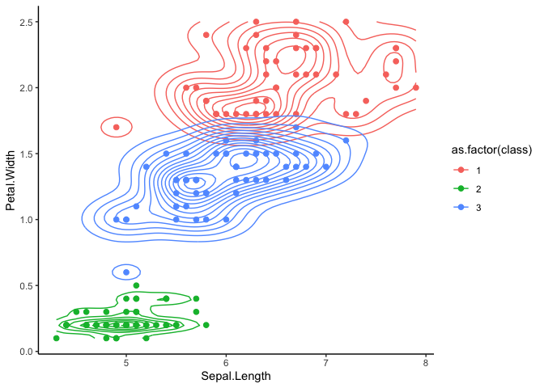
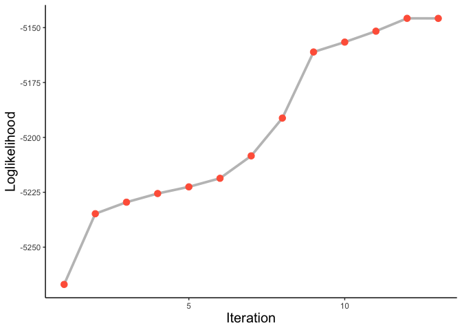

Penalized\_Model-Based\_Clustering
================

``` r
library(mvtnorm); library(plsgenomics); library(ggplot2)
```

    ## For any news related to the 'plsgenomics' package (update, corrected bugs), please check http://thoth.inrialpes.fr/people/gdurif/

    ## C++ based sparse PLS routines will soon be available on the CRAN in the new 'fastPLS' package.

<<<<<<< HEAD
1 Gaussian mixture model (multivariate ver)
===========================================
=======
<<<<<<< HEAD
1 Gaussian mixture model (multivariate ver)
===========================================
=======
1. Gaussian mixture model (multivariate ver)
============================================
>>>>>>> b22033d35cb5fa5a3c54034911011aa298a58abe
>>>>>>> cafdfccece3d21031c4582fc61d033d2bfe60710

1) R code
---------

``` r
em.multiv.ex2.input.k=function(data,iter.max=1000,k=2,seed=1,show.iter=F,eps=1e-15) {
  require(mvtnorm)
  set.seed(seed)
  loglike.h=rep(NA,iter.max)
  n=nrow(data)
  p.vec=rep(1/k,k)
  tau.list=vector("list",k)
  sample.ind=sample(c(1:k),nrow(data),replace=T,prob=p.vec)
  
  mu.list=vector("list",k)
  sigma.list=vector("list",k)
  for (c in 1:k) {
    mu.list[[c]]=colMeans(data[sample.ind==c,])
    sigma.list[[c]]=cov(data[sample.ind==c,])
  }
  
  tau.mod=vector("list",k)
  for (iter in 1:iter.max) {
    ####### E Step
    for (c in 1:k) {
      tau.mod[[c]]=(p.vec[c]*dmvnorm(data,mu.list[[c]],sigma.list[[c]]))
      tau.mat=matrix(unlist(tau.mod),nrow=n)
    }
    for (c2 in 1:k) {tau.list[[c2]]=tau.mat[,c2]/rowSums(tau.mat)}
    ####### M Step
    for (c2 in 1:k) {
      mu.list[[c2]]=colSums(tau.list[[c2]]*(data)/sum(tau.list[[c2]]))
      sigma.list[[c2]]=cov.wt(data,tau.list[[c2]],center = T)$cov
      p.vec[c2]=sum(tau.list[[c2]])/n
    }
    ####
    like.df=data.frame(k=1:k,loglik=rep(0,k))
    for (c2 in 1:k) {
      like.df[c2,2]=sum(tau.list[[c2]]*(log(p.vec[c2])+log(dmvnorm(data,mu.list[[c2]],sigma.list[[c2]]))))
    }
    
    loglike.h[iter]=sum(like.df[,2])
    if(show.iter==T) {print(paste0("iteration: ",iter," / ",loglike.h[iter]))}
    if(iter>1) {
      if(loglike.h[iter]-loglike.h[iter-1]<eps){
        loglike.h=loglike.h[1:(iter)]
        break
      }
    }
  }
  cprob.list=vector("list",k)
  for (c2 in 1:k) {cprob.list[[c2]]=tau.mat[,c2]/rowSums(tau.mat)}
  return(list(mu=mu.list,sigma=sigma.list,pi=round(p.vec,4),like=data.frame(iter=1:(iter),likelihood=loglike.h),
              probs=matrix(round(unlist(cprob.list),4),nrow=n),
              class=apply(matrix(round(unlist(cprob.list),4),nrow=n),1,function(x){which.max(x)})))
}
```

2) Running
----------

``` r
clust.iris=em.multiv.ex2.input.k(as.matrix(iris[,c(1,4)]),iter.max=10000,eps=1e-11,k=3,seed=2)
```

3) Results
----------

### (1) classification table

``` r
table(pred=clust.iris$class,act=iris$Species)
```

    ##     act
    ## pred setosa versicolor virginica
    ##    1      0          1        46
    ##    2     49          0         0
    ##    3      1         49         4

### (2) plotting

``` r
library(ggplot2)
clust.iris.plot=data.frame(iris[,c(1,4)],class=clust.iris$class)
ggplot(clust.iris.plot,aes(Sepal.Length,Petal.Width,col=as.factor(class)))+geom_point(size=2)+geom_density2d()+theme_classic()
```



2. Penalized model-based clustering
===================================

1) R code
---------

``` r
em.lasso.ex2.input.k2=function(data,iter.max=1000,k=4,lam,seed=1,eps=1e-15) {
  require(mvtnorm)
  set.seed(seed);n=nrow(data);loglike.h=rep(NA,iter.max)
  p.vec=rep(1/k,k)
  sample.ind=sample(c(1:k),nrow(data),replace=T,prob=p.vec)
  tau.list=vector("list",k);mu.list=vector("list",k);sigma.list=vector("list",k)
  tau.mod=vector("list",k)
  sigma.calcu=diag(cov(data))
  for (c in 1:k) {
    mu.list[[c]]=colMeans(data[sample.ind==c,])
  }
  for (iter in 1:iter.max) {
    #####################################################################
    # E-step
    
    for (c in 1:k) {
      tau.mod[[c]]=(p.vec[c]*dmvnorm(data,mu.list[[c]],diag(sigma.calcu)))
      tau.mat=matrix(unlist(tau.mod),nrow=n)
    }
    
    for (c2 in 1:k) {tau.list[[c2]]=tau.mat[,c2]/rowSums(tau.mat)}
    
    #################################################################################    
    # M-step
    ############################3
    # sigma
    for (c2 in 1:k){
      for (j in 1:ncol(data)) {
        sigma.list[[c2]][j]=sum(tau.list[[c2]]*((data[,j]-mu.list[[c2]][j])^2))/n
      }
    }
    sigma.calcu=colSums(do.call(rbind,sigma.list))
    # phi and mu
    for (c2 in 1:k) {
      
      p.vec[c2]=sum(tau.list[[c2]])/n
      mu.list[[c2]]=colSums(tau.list[[c2]]*(data)/sum(tau.list[[c2]]))
      ## penalty.checking
      for (j in 1:ncol(data)) {
        if (lam > abs(sum(tau.list[[c2]]*data[,j]/sigma.calcu[j]))) {
          mu.list[[c2]][j]=0 
        } else {mu.list[[c2]][j]=sign(mu.list[[c2]][j])*(abs(mu.list[[c2]][j])-lam*sigma.calcu[j]/sum(tau.list[[c2]]))}
      }
    }
    #############################
    like.df=data.frame(k=1:k,loglik=rep(0,k))
    for (c2 in 1:k) {
      like.df[c2,2]=sum(tau.list[[c2]]*(log(p.vec[c2])+log(dmvnorm(data,mu.list[[c2]],diag(sigma.calcu)))))
    }
    loglike.h[iter]=sum(like.df[,2])-lam*sum(unlist(lapply(mu.list,sum)))
    print(paste0("iteration: ",iter," / ",loglike.h[iter]))
    if(iter>1) {
      if(loglike.h[iter]-loglike.h[iter-1]<eps){
        loglike.h=loglike.h[1:(iter)]
        break
      }
    }
  }
  cprob.list=vector("list",k)
  for (c2 in 1:k) {cprob.list[[c2]]=tau.mat[,c2]/rowSums(tau.mat)}
  return(list(mu=mu.list,sigma=sigma.calcu,pi=round(p.vec,4),like=data.frame(iter=1:(iter),likelihood=loglike.h),
              probs=matrix(round(unlist(cprob.list),4),nrow=n),
              class=apply(matrix(round(unlist(cprob.list),4),nrow=n),1,function(x){which.max(x)})))
}
```

2) analysis : Leukemia data
---------------------------

``` r
library(plsgenomics)
```

``` r
data(leukemia)
pen.clust.rst=em.lasso.ex2.input.k2(data=scale(leukemia$X[,1:100],center=T,scale=T),iter.max=1000,k=2,seed=1234,eps=1e-11,lam=1)
```

    ## [1] "iteration: 1 / -5266.97867009941"
    ## [1] "iteration: 2 / -5234.76782659881"
    ## [1] "iteration: 3 / -5229.51989383179"
    ## [1] "iteration: 4 / -5225.5711335652"
    ## [1] "iteration: 5 / -5222.5302574024"
    ## [1] "iteration: 6 / -5218.62959334651"
    ## [1] "iteration: 7 / -5208.41366513805"
    ## [1] "iteration: 8 / -5191.20060645862"
    ## [1] "iteration: 9 / -5161.09838080982"
    ## [1] "iteration: 10 / -5156.59874868866"
    ## [1] "iteration: 11 / -5151.62244934675"
    ## [1] "iteration: 12 / -5145.76739460155"
    ## [1] "iteration: 13 / -5145.78750608309"

### (1) loglikelihood

``` r
ggplot(pen.clust.rst$like,aes(iter,likelihood))+geom_line(size=1.3,alpha=0.3)+
  geom_point(size=3,col="tomato")+labs(x="Iteration",y="Loglikelihood")+
  theme_classic()+theme(axis.title=element_text(size=15))
```



### (2) Variable selection

``` r
pen.clust.rst
```

    ## $mu
    ## $mu[[1]]
    ##   [1] -0.178253031 -0.169406630  0.000000000  0.000000000  0.022095630
    ##   [6]  0.004428595  0.000000000  0.000000000  0.002072055  0.000000000
    ##  [11] -0.371818402 -0.300283402 -0.265307971  0.000000000 -0.037114023
    ##  [16] -0.253115683  0.056613671 -0.246706146 -0.110795030 -0.235938488
    ##  [21] -0.054170702 -0.123738032  0.366858309  0.001055322  0.178736644
    ##  [26] -0.180653679  0.111845178 -0.017190629 -0.078133266 -0.036133963
    ##  [31] -0.134064158 -0.319504117  0.121205939  0.000000000 -0.119279467
    ##  [36] -0.385430846  0.151875094  0.045787140  0.284130425 -0.048307988
    ##  [41] -0.264558421 -0.111596621 -0.264813507  0.040312305  0.000000000
    ##  [46]  0.061223106  0.199854175  0.318606118 -0.029265021 -0.376078484
    ##  [51]  0.067748526 -0.130238694 -0.130170608 -0.038382610  0.296986750
    ##  [56] -0.213666790 -0.045609566  0.065476358  0.346820869 -0.238766250
    ##  [61]  0.140838318 -0.262003476  0.382291350  0.186615820  0.374510072
    ##  [66]  0.550554724 -0.174916176 -0.290608913  0.227896697  0.000000000
    ##  [71]  0.184343983 -0.148605174 -0.015446209  0.270275221  0.163294005
    ##  [76]  0.035704683  0.165560592  0.417179042  0.270835885  0.104433439
    ##  [81]  0.372704613 -0.162497541  0.206675684  0.282840107 -0.042923392
    ##  [86]  0.000000000  0.000000000  0.085044686  0.193035549 -0.080225109
    ##  [91]  0.000000000  0.164461053  0.107136949  0.032819753  0.159314688
    ##  [96]  0.460338985  0.003666378  0.250317472  0.056792511 -0.237089983
    ## 
    ## $mu[[2]]
    ##   [1]  0.341673918  0.324717211  0.000000000  0.000000000 -0.042352719
    ##   [6] -0.008488695  0.000000000  0.000000000 -0.003971697  0.000000000
    ##  [11]  0.712698402  0.575580711  0.508540100  0.000000000  0.071139849
    ##  [16]  0.485170024 -0.108516611  0.472884277  0.212370985  0.452244919
    ##  [21]  0.103833948  0.237180025 -0.703190938 -0.002022832 -0.342600903
    ##  [26]  0.346275460 -0.214383902  0.032950854  0.149765191  0.069261277
    ##  [31]  0.256973056  0.612422818 -0.232326529  0.000000000  0.228633884
    ##  [36]  0.738790621 -0.291112910 -0.087764406 -0.544618822  0.092596347
    ##  [41]  0.507103367  0.213907470  0.507592314 -0.077270289  0.000000000
    ##  [46] -0.117351937 -0.383078811 -0.610701540  0.056094948  0.720864090
    ##  [51] -0.129859809  0.249640439  0.249509932  0.073571466 -0.569261718
    ##  [56]  0.409554715  0.087424035 -0.125504535 -0.664783340  0.457665149
    ##  [61] -0.269957709  0.502206071 -0.732772861 -0.357703642 -0.717857771
    ##  [66] -1.055298687  0.335277862  0.557036734 -0.436830483  0.000000000
    ##  [71] -0.353349004  0.284845153  0.029607165 -0.518061282 -0.313000582
    ##  [76] -0.068438438 -0.317345157 -0.799645297 -0.519135957 -0.200177142
    ##  [81] -0.714397083  0.311473927 -0.396154222 -0.542145550  0.082275198
    ##  [86]  0.000000000  0.000000000 -0.163012942 -0.370008925  0.153774817
    ##  [91]  0.000000000 -0.315237570 -0.205359208 -0.062908627 -0.305373060
    ##  [96] -0.882373914 -0.007027683 -0.479806435 -0.108859411  0.454452096
    ## 
    ## 
    ## $sigma
    ##   [1] 0.8884361 0.8953484 0.9736842 0.9736842 0.9694238 0.9729557 0.9736842
    ##   [8] 0.9736842 0.9733281 0.9736842 0.6704089 0.7655038 0.8059191 0.9736842
    ##  [15] 0.9655924 0.8189307 0.9591707 0.8257701 0.9343105 0.8367349 0.9601466
    ##  [22] 0.9267175 0.6775710 0.9734805 0.8882145 0.8865186 0.9337027 0.9705334
    ##  [29] 0.9506009 0.9658856 0.9202275 0.7416846 0.9282653 0.9736842 0.9293846
    ##  [36] 0.6503992 0.9082289 0.9628627 0.7847211 0.9621163 0.8067534 0.9338290
    ##  [43] 0.8065197 0.9644986 0.9736842 0.9573546 0.8703925 0.7427628 0.9676429
    ##  [50] 0.6642634 0.9550096 0.9227297 0.9227689 0.9651186 0.7695612 0.8580809
    ##  [57] 0.9630184 0.9557604 0.7055215 0.8338827 0.9158428 0.8094920 0.6550784
    ##  [64] 0.8816461 0.6665148 0.3620748 0.8912957 0.7772438 0.8445074 0.9736842
    ##  [71] 0.8834467 0.9106281 0.9710209 0.8004514 0.9000888 0.9659205 0.8982853
    ##  [78] 0.6015319 0.7998017 0.9377345 0.6691582 0.9006231 0.8643715 0.7862269
    ##  [85] 0.9637469 0.9736842 0.9736842 0.9474341 0.8762838 0.9497160 0.9736842
    ##  [92] 0.8990885 0.9362427 0.9668552 0.9029466 0.5300454 0.9730893 0.8219342
    ##  [99] 0.9591833 0.8354870
    ## 
    ## $pi
    ## [1] 0.6572 0.3428
    ## 
    ## $like
    ##    iter likelihood
    ## 1     1  -5266.979
    ## 2     2  -5234.768
    ## 3     3  -5229.520
    ## 4     4  -5225.571
    ## 5     5  -5222.530
    ## 6     6  -5218.630
    ## 7     7  -5208.414
    ## 8     8  -5191.201
    ## 9     9  -5161.098
    ## 10   10  -5156.599
    ## 11   11  -5151.622
    ## 12   12  -5145.767
    ## 13   13  -5145.788
    ## 
    ## $probs
    ##         [,1]   [,2]
    ##  [1,] 1.0000 0.0000
    ##  [2,] 0.9997 0.0003
    ##  [3,] 1.0000 0.0000
    ##  [4,] 1.0000 0.0000
    ##  [5,] 1.0000 0.0000
    ##  [6,] 0.9874 0.0126
    ##  [7,] 1.0000 0.0000
    ##  [8,] 0.0000 1.0000
    ##  [9,] 1.0000 0.0000
    ## [10,] 1.0000 0.0000
    ## [11,] 1.0000 0.0000
    ## [12,] 0.9961 0.0039
    ## [13,] 1.0000 0.0000
    ## [14,] 1.0000 0.0000
    ## [15,] 1.0000 0.0000
    ## [16,] 1.0000 0.0000
    ## [17,] 0.0003 0.9997
    ## [18,] 1.0000 0.0000
    ## [19,] 1.0000 0.0000
    ## [20,] 1.0000 0.0000
    ## [21,] 1.0000 0.0000
    ## [22,] 0.0000 1.0000
    ## [23,] 0.9958 0.0042
    ## [24,] 1.0000 0.0000
    ## [25,] 0.0000 1.0000
    ## [26,] 1.0000 0.0000
    ## [27,] 1.0000 0.0000
    ## [28,] 0.0000 1.0000
    ## [29,] 1.0000 0.0000
    ## [30,] 0.0000 1.0000
    ## [31,] 0.9927 0.0073
    ## [32,] 0.0000 1.0000
    ## [33,] 0.0000 1.0000
    ## [34,] 0.0000 1.0000
    ## [35,] 0.0000 1.0000
    ## [36,] 0.0000 1.0000
    ## [37,] 0.0000 1.0000
    ## [38,] 0.0000 1.0000
    ## 
    ## $class
    ##  [1] 1 1 1 1 1 1 1 2 1 1 1 1 1 1 1 1 2 1 1 1 1 2 1 1 2 1 1 2 1 2 1 2 2 2 2 2 2 2

``` r
select.ind=as.logical(1-(pen.clust.rst$mu[[1]]==0 & pen.clust.rst$mu[[2]]==0))
drop(leukemia$gene.names[1:100,3])[select.ind]
```

    ##  [1] "AFFX-HUMISGF3A/M97935_MA_at" "AFFX-HUMISGF3A/M97935_MB_at"
    ##  [3] "AFFX-HUMRGE/M10098_M_at"     "AFFX-HUMRGE/M10098_3_at"    
    ##  [5] "AFFX-HSAC07/X00351_5_at"     "AFFX-HUMTFRR/M11507_5_at"   
    ##  [7] "AFFX-HUMTFRR/M11507_M_at"    "AFFX-HUMTFRR/M11507_3_at"   
    ##  [9] "AFFX-M27830_M_at"            "AFFX-M27830_3_at"           
    ## [11] "AFFX-HSAC07/X00351_3_st"     "AFFX-HUMGAPDH/M33197_M_st"  
    ## [13] "AFFX-HUMGAPDH/M33197_3_st"   "AFFX-HSAC07/X00351_M_st"    
    ## [15] "A28102_at"                   "AB000115_at"                
    ## [17] "AB000449_at"                 "AB000464_at"                
    ## [19] "AB000468_at"                 "AB000584_at"                
    ## [21] "AB001106_at"                 "AB001325_at"                
    ## [23] "AB002315_at"                 "AB002318_at"                
    ## [25] "AB002382_at"                 "AB002559_at"                
    ## [27] "AB003177_at"                 "AC000064_cds1_at"           
    ## [29] "AC002073_cds1_at"            "AC002115_cds1_at"           
    ## [31] "AC002115_rna2_at"            "AF000231_at"                
    ## [33] "AF000560_at"                 "AF000562_at"                
    ## [35] "AF002224_at"                 "AF002700_at"                
    ## [37] "AF003743_at"                 "AF006084_at"                
    ## [39] "AF006087_at"                 "AF007875_at"                
    ## [41] "AF008445_at"                 "AF008937_at"                
    ## [43] "AF009301_at"                 "AF010193_at"                
    ## [45] "AF014958_at"                 "AF015910_at"                
    ## [47] "AF015913_at"                 "AJ000480_at"                
    ## [49] "AJ001421_at"                 "D00017_at"                  
    ## [51] "D00596_at"                   "D00632_at"                  
    ## [53] "D00723_at"                   "D00726_at"                  
    ## [55] "D00760_at"                   "D00761_at"                  
    ## [57] "D00762_at"                   "D00763_at"                  
    ## [59] "D10202_at"                   "D10495_at"                  
    ## [61] "D10511_at"                   "D10523_at"                  
    ## [63] "D10923_at"                   "D10995_at"                  
    ## [65] "D11086_at"                   "D11094_at"                  
    ## [67] "D11428_at"                   "D13315_at"                  
    ## [69] "D13370_at"                   "D13435_at"                  
    ## [71] "D13626_at"                   "D13627_at"                  
    ## [73] "D13628_at"                   "D13630_at"                  
    ## [75] "D13636_at"                   "D13639_at"                  
    ## [77] "D13643_at"                   "D13645_at"                  
    ## [79] "D13748_at"                   "D13900_at"                  
    ## [81] "D13988_at"                   "D14043_at"                  
    ## [83] "D14657_at"                   "D14658_at"                  
    ## [85] "D14661_at"                   "D14662_at"                  
    ## [87] "D14663_at"                   "D14686_at"

### (3) Clustering result : classification table

``` r
table(pred=pen.clust.rst$class,act=leukemia$Y)
```

    ##     act
    ## pred  1  2
    ##    1 23  2
    ##    2  4  9

``` r
sum(diag(table(pred=pen.clust.rst$class,act=leukemia$Y)))/length(leukemia$Y)
```

    ## [1] 0.8421053
