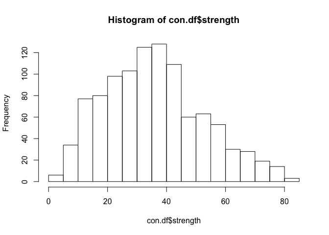
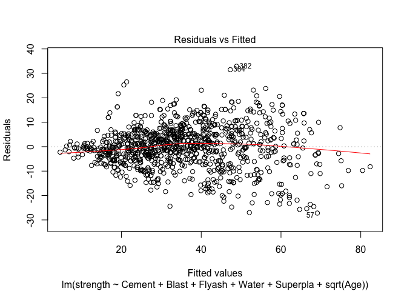
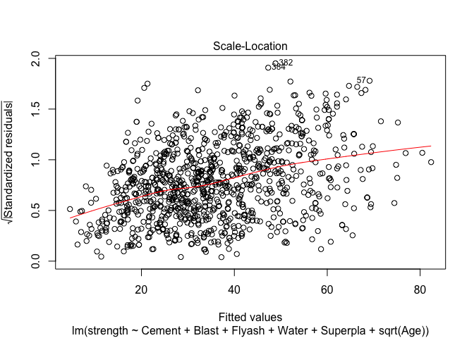
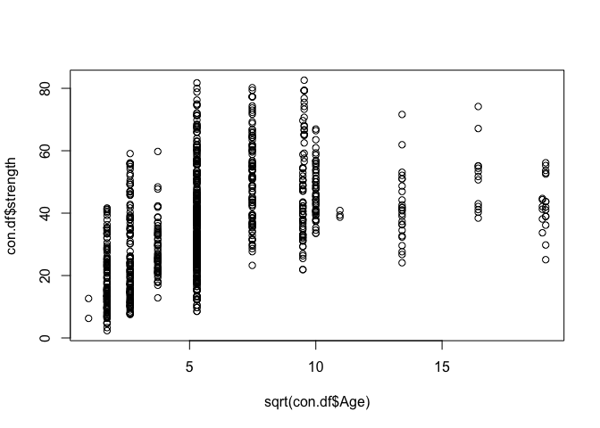
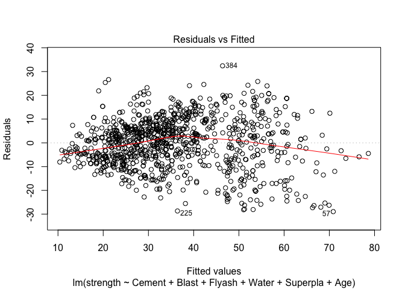
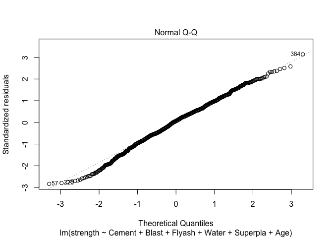

Concrete
================

### Prerequisites

``` r
rm(list=ls()); library(gdata); library(corrplot); library(ggplot2); library(DataExplorer); library(car); library(MASS); library(caret)
```

    ## gdata: read.xls support for 'XLS' (Excel 97-2004) files ENABLED.

    ## 

    ## gdata: read.xls support for 'XLSX' (Excel 2007+) files ENABLED.

    ## 
    ## Attaching package: 'gdata'

    ## The following object is masked from 'package:stats':
    ## 
    ##     nobs

    ## The following object is masked from 'package:utils':
    ## 
    ##     object.size

    ## The following object is masked from 'package:base':
    ## 
    ##     startsWith

    ## corrplot 0.84 loaded

    ## Loading required package: carData

    ## Loading required package: lattice

``` r
options("scipen"=100, "digits"=3)
```

### Read Data

``` r
con.df = read.xls("data/Concrete.xls")
colnames(con.df) = c("Cement", "Blast", "Flyash", "Water", "Superpla", "CoarseAgg", "FineAgg", "Age", "strength")
```

### EDA

``` r
plot_histogram(con.df, nrow=3L, ncol=3L)
```


``` r
plot_scatterplot(con.df,geom_point_args=list(size=0.7), by="strength", 
                 nrow=3L,ncol=3L)
```


``` r
corrplot(cor(con.df))
```


``` r
summary(con.df)
```

    ##      Cement        Blast         Flyash          Water        Superpla   
    ##  Min.   :102   Min.   :  0   Min.   :  0.0   Min.   :122   Min.   : 0.0  
    ##  1st Qu.:192   1st Qu.:  0   1st Qu.:  0.0   1st Qu.:165   1st Qu.: 0.0  
    ##  Median :273   Median : 22   Median :  0.0   Median :185   Median : 6.4  
    ##  Mean   :281   Mean   : 74   Mean   : 54.2   Mean   :182   Mean   : 6.2  
    ##  3rd Qu.:350   3rd Qu.:143   3rd Qu.:118.3   3rd Qu.:192   3rd Qu.:10.2  
    ##  Max.   :540   Max.   :359   Max.   :200.1   Max.   :247   Max.   :32.2  
    ##    CoarseAgg       FineAgg         Age         strength   
    ##  Min.   : 801   Min.   :594   Min.   :  1   Min.   : 2.3  
    ##  1st Qu.: 932   1st Qu.:731   1st Qu.:  7   1st Qu.:23.7  
    ##  Median : 968   Median :780   Median : 28   Median :34.4  
    ##  Mean   : 973   Mean   :774   Mean   : 46   Mean   :35.8  
    ##  3rd Qu.:1029   3rd Qu.:824   3rd Qu.: 56   3rd Qu.:46.1  
    ##  Max.   :1145   Max.   :993   Max.   :365   Max.   :82.6

``` r
cor(con.df)
```

    ##            Cement   Blast   Flyash   Water Superpla CoarseAgg FineAgg      Age
    ## Cement     1.0000 -0.2752 -0.39747 -0.0816   0.0924  -0.10935 -0.2227  0.08195
    ## Blast     -0.2752  1.0000 -0.32358  0.1073   0.0433  -0.28400 -0.2816 -0.04425
    ## Flyash    -0.3975 -0.3236  1.00000 -0.2570   0.3775  -0.00996  0.0791 -0.15437
    ## Water     -0.0816  0.1073 -0.25698  1.0000  -0.6575  -0.18229 -0.4507  0.27762
    ## Superpla   0.0924  0.0433  0.37750 -0.6575   1.0000  -0.26600  0.2227 -0.19270
    ## CoarseAgg -0.1093 -0.2840 -0.00996 -0.1823  -0.2660   1.00000 -0.1785 -0.00302
    ## FineAgg   -0.2227 -0.2816  0.07911 -0.4507   0.2227  -0.17848  1.0000 -0.15609
    ## Age        0.0819 -0.0442 -0.15437  0.2776  -0.1927  -0.00302 -0.1561  1.00000
    ## strength   0.4978  0.1348 -0.10575 -0.2896   0.3661  -0.16493 -0.1672  0.32887
    ##           strength
    ## Cement       0.498
    ## Blast        0.135
    ## Flyash      -0.106
    ## Water       -0.290
    ## Superpla     0.366
    ## CoarseAgg   -0.165
    ## FineAgg     -0.167
    ## Age          0.329
    ## strength     1.000

Model
-----

``` r
fit1 = lm(strength ~ Cement + Blast + Flyash + Water +
            Superpla + CoarseAgg + FineAgg + Age, data=con.df)
summary(fit1)
```

    ## 
    ## Call:
    ## lm(formula = strength ~ Cement + Blast + Flyash + Water + Superpla + 
    ##     CoarseAgg + FineAgg + Age, data = con.df)
    ## 
    ## Residuals:
    ##    Min     1Q Median     3Q    Max 
    ## -28.65  -6.30   0.70   6.57  34.45 
    ## 
    ## Coefficients:
    ##              Estimate Std. Error t value             Pr(>|t|)    
    ## (Intercept) -23.33121   26.58550   -0.88               0.3804    
    ## Cement        0.11980    0.00849   14.11 < 0.0000000000000002 ***
    ## Blast         0.10387    0.01014   10.25 < 0.0000000000000002 ***
    ## Flyash        0.08793    0.01258    6.99       0.000000000005 ***
    ## Water        -0.14992    0.04018   -3.73               0.0002 ***
    ## Superpla      0.29222    0.09342    3.13               0.0018 ** 
    ## CoarseAgg     0.01809    0.00939    1.93               0.0544 .  
    ## FineAgg       0.02019    0.01070    1.89               0.0595 .  
    ## Age           0.11422    0.00543   21.05 < 0.0000000000000002 ***
    ## ---
    ## Signif. codes:  0 '***' 0.001 '**' 0.01 '*' 0.05 '.' 0.1 ' ' 1
    ## 
    ## Residual standard error: 10.4 on 1021 degrees of freedom
    ## Multiple R-squared:  0.616,  Adjusted R-squared:  0.613 
    ## F-statistic:  204 on 8 and 1021 DF,  p-value: <0.0000000000000002

``` r
plot(fit1)
```


``` r
vif(fit1)
```

    ##    Cement     Blast    Flyash     Water  Superpla CoarseAgg   FineAgg       Age 
    ##      7.49      7.28      6.17      7.00      2.96      5.07      7.01      1.12

``` r
# write.csv(t(vif_fit1), "vif_1.csv")
hist(con.df$strength)
```



``` r
hist(sqrt(con.df$strength))
```


### fit2 Delete FineAgg (다중공선성 해결)

``` r
fit2 = lm(strength ~ Cement + Blast + Flyash + Water +
            Superpla + CoarseAgg + Age, data=con.df)
summary(fit2)
```

    ## 
    ## Call:
    ## lm(formula = strength ~ Cement + Blast + Flyash + Water + Superpla + 
    ##     CoarseAgg + Age, data = con.df)
    ## 
    ## Residuals:
    ##    Min     1Q Median     3Q    Max 
    ## -28.85  -6.51   0.59   6.67  34.41 
    ## 
    ## Coefficients:
    ##             Estimate Std. Error t value            Pr(>|t|)    
    ## (Intercept) 23.97864    8.84159    2.71              0.0068 ** 
    ## Cement       0.10606    0.00436   24.30 <0.0000000000000002 ***
    ## Blast        0.08744    0.00520   16.82 <0.0000000000000002 ***
    ## Flyash       0.06929    0.00780    8.89 <0.0000000000000002 ***
    ## Water       -0.21100    0.02382   -8.86 <0.0000000000000002 ***
    ## Superpla     0.26422    0.09235    2.86              0.0043 ** 
    ## CoarseAgg    0.00339    0.00525    0.65              0.5190    
    ## Age          0.11334    0.00541   20.94 <0.0000000000000002 ***
    ## ---
    ## Signif. codes:  0 '***' 0.001 '**' 0.01 '*' 0.05 '.' 0.1 ' ' 1
    ## 
    ## Residual standard error: 10.4 on 1022 degrees of freedom
    ## Multiple R-squared:  0.614,  Adjusted R-squared:  0.612 
    ## F-statistic:  232 on 7 and 1022 DF,  p-value: <0.0000000000000002

``` r
vif_fit2 = vif(fit2)
anova(fit2,fit1)
```

    ## Analysis of Variance Table
    ## 
    ## Model 1: strength ~ Cement + Blast + Flyash + Water + Superpla + CoarseAgg + 
    ##     Age
    ## Model 2: strength ~ Cement + Blast + Flyash + Water + Superpla + CoarseAgg + 
    ##     FineAgg + Age
    ##   Res.Df    RSS Df Sum of Sq    F Pr(>F)  
    ## 1   1022 110798                           
    ## 2   1021 110413  1       385 3.56  0.059 .
    ## ---
    ## Signif. codes:  0 '***' 0.001 '**' 0.01 '*' 0.05 '.' 0.1 ' ' 1

### fit3 Delete CoarseAgg (Backward)

``` r
fit3 = stepAIC(fit2,direction="backward")
```

    ## Start:  AIC=4834
    ## strength ~ Cement + Blast + Flyash + Water + Superpla + CoarseAgg + 
    ##     Age
    ## 
    ##             Df Sum of Sq    RSS  AIC
    ## - CoarseAgg  1        45 110843 4833
    ## <none>                   110798 4834
    ## - Superpla   1       887 111685 4841
    ## - Water      1      8504 119303 4909
    ## - Flyash     1      8559 119357 4909
    ## - Blast      1     30689 141487 5084
    ## - Age        1     47518 158316 5200
    ## - Cement     1     64017 174815 5302
    ## 
    ## Step:  AIC=4833
    ## strength ~ Cement + Blast + Flyash + Water + Superpla + Age
    ## 
    ##            Df Sum of Sq    RSS  AIC
    ## <none>                  110843 4833
    ## - Superpla  1       875 111718 4839
    ## - Flyash    1      8537 119381 4907
    ## - Water     1     11543 122386 4933
    ## - Blast     1     32750 143593 5098
    ## - Age       1     47728 158571 5200
    ## - Cement    1     66774 177617 5317

``` r
# fit3 = lm(strength ~ Cement + Blast + Flyash + Water +
#             Superpla + Age, data=con.df)
summary(fit3)
```

    ## 
    ## Call:
    ## lm(formula = strength ~ Cement + Blast + Flyash + Water + Superpla + 
    ##     Age, data = con.df)
    ## 
    ## Residuals:
    ##    Min     1Q Median     3Q    Max 
    ## -28.99  -6.47   0.65   6.55  34.73 
    ## 
    ## Coefficients:
    ##             Estimate Std. Error t value             Pr(>|t|)    
    ## (Intercept) 28.99298    4.21320    6.88        0.00000000001 ***
    ## Cement       0.10541    0.00425   24.82 < 0.0000000000000002 ***
    ## Blast        0.08647    0.00497   17.39 < 0.0000000000000002 ***
    ## Flyash       0.06866    0.00774    8.88 < 0.0000000000000002 ***
    ## Water       -0.21809    0.02113  -10.32 < 0.0000000000000002 ***
    ## Superpla     0.24031    0.08457    2.84               0.0046 ** 
    ## Age          0.11349    0.00541   20.99 < 0.0000000000000002 ***
    ## ---
    ## Signif. codes:  0 '***' 0.001 '**' 0.01 '*' 0.05 '.' 0.1 ' ' 1
    ## 
    ## Residual standard error: 10.4 on 1023 degrees of freedom
    ## Multiple R-squared:  0.614,  Adjusted R-squared:  0.612 
    ## F-statistic:  271 on 6 and 1023 DF,  p-value: <0.0000000000000002

``` r
anova(fit3,fit2)
```

    ## Analysis of Variance Table
    ## 
    ## Model 1: strength ~ Cement + Blast + Flyash + Water + Superpla + Age
    ## Model 2: strength ~ Cement + Blast + Flyash + Water + Superpla + CoarseAgg + 
    ##     Age
    ##   Res.Df    RSS Df Sum of Sq    F Pr(>F)
    ## 1   1023 110843                         
    ## 2   1022 110798  1      45.1 0.42   0.52

``` r
plot(fit3)
```


### fit4 sqrt(Age)

``` r
fit4 = lm(strength ~ Cement + Blast + Flyash + Water +
            Superpla + sqrt(Age), data=con.df)
summary(fit4)
```

    ## 
    ## Call:
    ## lm(formula = strength ~ Cement + Blast + Flyash + Water + Superpla + 
    ##     sqrt(Age), data = con.df)
    ## 
    ## Residuals:
    ##    Min     1Q Median     3Q    Max 
    ## -27.18  -4.92  -0.12   5.20  32.90 
    ## 
    ## Coefficients:
    ##             Estimate Std. Error t value             Pr(>|t|)    
    ## (Intercept) 23.47170    3.48600    6.73       0.000000000028 ***
    ## Cement       0.10678    0.00354   30.17 < 0.0000000000000002 ***
    ## Blast        0.08810    0.00414   21.26 < 0.0000000000000002 ***
    ## Flyash       0.06789    0.00644   10.55 < 0.0000000000000002 ***
    ## Water       -0.24216    0.01758  -13.78 < 0.0000000000000002 ***
    ## Superpla     0.15277    0.07060    2.16                0.031 *  
    ## sqrt(Age)    2.62412    0.07975   32.90 < 0.0000000000000002 ***
    ## ---
    ## Signif. codes:  0 '***' 0.001 '**' 0.01 '*' 0.05 '.' 0.1 ' ' 1
    ## 
    ## Residual standard error: 8.68 on 1023 degrees of freedom
    ## Multiple R-squared:  0.732,  Adjusted R-squared:  0.73 
    ## F-statistic:  465 on 6 and 1023 DF,  p-value: <0.0000000000000002

``` r
plot(fit4)
```



``` r
plot(con.df$Age, con.df$strength)
```


``` r
plot(sqrt(con.df$Age), con.df$strength)
```



### Outlier Detection

``` r
outliers = outlierTest(fit4)

rstudent_1= outliers[[1]]
unadjusted_p=outliers[[2]]
Bonferroni_p=outliers[[3]]
out.df=cbind(rstudent_1,unadjusted_p,Bonferroni_p)

out.df
```

    ##     rstudent_1 unadjusted_p Bonferroni_p
    ## 382       3.83     0.000135        0.139

``` r
out.obs=as.numeric(row.names(out.df))
out_con_df = con.df[-c(out.obs),]
```

### fit5 Without Outlier

``` r
fit5 = lm(strength ~ Cement + Blast + Flyash + Water + Superpla + Age, data=out_con_df)
summary(fit5)
```

    ## 
    ## Call:
    ## lm(formula = strength ~ Cement + Blast + Flyash + Water + Superpla + 
    ##     Age, data = out_con_df)
    ## 
    ## Residuals:
    ##    Min     1Q Median     3Q    Max 
    ## -28.94  -6.34   0.67   6.58  32.41 
    ## 
    ## Coefficients:
    ##             Estimate Std. Error t value             Pr(>|t|)    
    ## (Intercept) 27.97014    4.20307    6.65       0.000000000046 ***
    ## Cement       0.10525    0.00423   24.91 < 0.0000000000000002 ***
    ## Blast        0.08597    0.00495   17.36 < 0.0000000000000002 ***
    ## Flyash       0.06878    0.00770    8.94 < 0.0000000000000002 ***
    ## Water       -0.21264    0.02109  -10.08 < 0.0000000000000002 ***
    ## Superpla     0.25327    0.08423    3.01               0.0027 ** 
    ## Age          0.11338    0.00538   21.07 < 0.0000000000000002 ***
    ## ---
    ## Signif. codes:  0 '***' 0.001 '**' 0.01 '*' 0.05 '.' 0.1 ' ' 1
    ## 
    ## Residual standard error: 10.4 on 1022 degrees of freedom
    ## Multiple R-squared:  0.615,  Adjusted R-squared:  0.613 
    ## F-statistic:  273 on 6 and 1022 DF,  p-value: <0.0000000000000002

``` r
plot(fit5)
```


