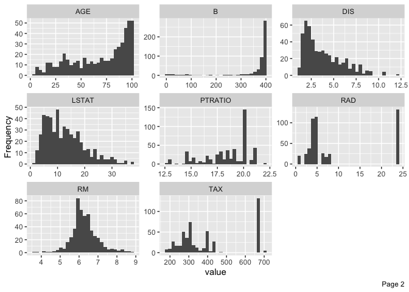
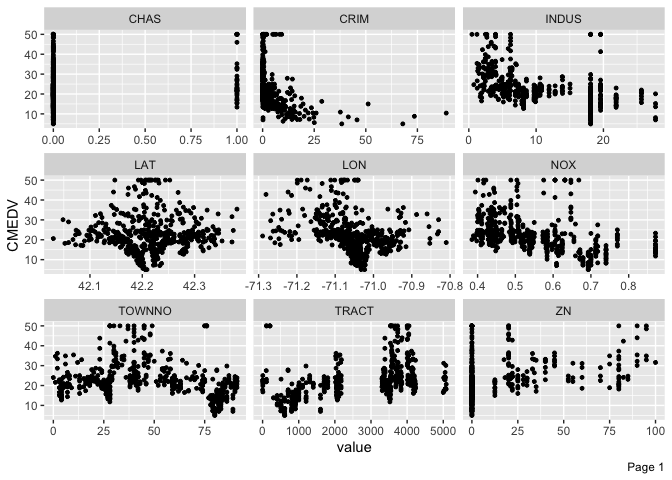
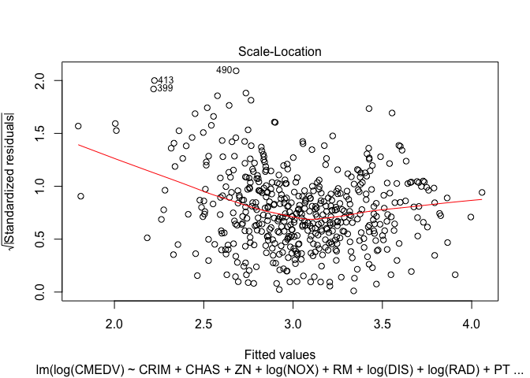

Boston
================

### Prerequisites

``` r
rm(list=ls())

library(corrplot); library(ggplot2); library(DataExplorer); library(car); library(MASS)
```

    ## corrplot 0.84 loaded

    ## Loading required package: carData

``` r
options("scipen"=100, "digits"=3)
```

### Read Data

``` r
boston = read.csv("data/Boston_csv.csv")
head(boston)
```

    ##   NO       TOWN TOWNNO TRACT   LON  LAT MEDV CMEDV    CRIM ZN INDUS CHAS   NOX
    ## 1  1     Nahant      0  2011 -71.0 42.3 24.0  24.0 0.00632 18  2.31    0 0.538
    ## 2  2 Swampscott      1  2021 -71.0 42.3 21.6  21.6 0.02731  0  7.07    0 0.469
    ## 3  3 Swampscott      1  2022 -70.9 42.3 34.7  34.7 0.02729  0  7.07    0 0.469
    ## 4  4 Marblehead      2  2031 -70.9 42.3 33.4  33.4 0.03237  0  2.18    0 0.458
    ## 5  5 Marblehead      2  2032 -70.9 42.3 36.2  36.2 0.06905  0  2.18    0 0.458
    ## 6  6 Marblehead      2  2033 -70.9 42.3 28.7  28.7 0.02985  0  2.18    0 0.458
    ##     RM  AGE  DIS RAD TAX PTRATIO   B LSTAT
    ## 1 6.58 65.2 4.09   1 296    15.3 397  4.98
    ## 2 6.42 78.9 4.97   2 242    17.8 397  9.14
    ## 3 7.18 61.1 4.97   2 242    17.8 393  4.03
    ## 4 7.00 45.8 6.06   3 222    18.7 395  2.94
    ## 5 7.15 54.2 6.06   3 222    18.7 397  5.33
    ## 6 6.43 58.7 6.06   3 222    18.7 394  5.21

### Data Summary(EDA)

``` r
t(summary(boston[,-1])[c(1,3,4,6),])
```

    ##                                                                    
    ##                TOWN Cambridge        : 30   Lynn             : 22  
    ##     TOWNNO          Min.   : 0.0            Median :42.0           
    ##     TRACT           Min.   :   1            Median :3394           
    ##      LON            Min.   :-71.3           Median :-71.1          
    ##      LAT            Min.   :42.0            Median :42.2           
    ##      MEDV           Min.   : 5.0            Median :21.2           
    ##     CMEDV           Min.   : 5.0            Median :21.2           
    ##      CRIM           Min.   : 0.0            Median : 0.3           
    ##       ZN            Min.   :  0.0           Median :  0.0          
    ##     INDUS           Min.   : 0.46           Median : 9.69          
    ##      CHAS           Min.   :0.000           Median :0.000          
    ##      NOX            Min.   :0.385           Median :0.538          
    ##       RM            Min.   :3.56            Median :6.21           
    ##      AGE            Min.   :  2.9           Median : 77.5          
    ##      DIS            Min.   : 1.13           Median : 3.21          
    ##      RAD            Min.   : 1.00           Median : 5.00          
    ##      TAX            Min.   :187             Median :330            
    ##    PTRATIO          Min.   :12.6            Median :19.1           
    ##       B             Min.   :  0             Median :391            
    ##     LSTAT           Min.   : 1.7            Median :11.4           
    ##                                                                    
    ##                TOWN Boston Roxbury   : 19   Somerville       : 15  
    ##     TOWNNO          Mean   :47.5            Max.   :91.0           
    ##     TRACT           Mean   :2700            Max.   :5082           
    ##      LON            Mean   :-71.1           Max.   :-70.8          
    ##      LAT            Mean   :42.2            Max.   :42.4           
    ##      MEDV           Mean   :22.5            Max.   :50.0           
    ##     CMEDV           Mean   :22.5            Max.   :50.0           
    ##      CRIM           Mean   : 3.6            Max.   :89.0           
    ##       ZN            Mean   : 11.4           Max.   :100.0          
    ##     INDUS           Mean   :11.14           Max.   :27.74          
    ##      CHAS           Mean   :0.069           Max.   :1.000          
    ##      NOX            Mean   :0.555           Max.   :0.871          
    ##       RM            Mean   :6.28            Max.   :8.78           
    ##      AGE            Mean   : 68.6           Max.   :100.0          
    ##      DIS            Mean   : 3.80           Max.   :12.13          
    ##      RAD            Mean   : 9.55           Max.   :24.00          
    ##      TAX            Mean   :408             Max.   :711            
    ##    PTRATIO          Mean   :18.5            Max.   :22.0           
    ##       B             Mean   :357             Max.   :397            
    ##     LSTAT           Mean   :12.7            Max.   :38.0

``` r
bs_df = boston[,3:dim(boston)[2]]
bs_df = bs_df[,-5]

plot_histogram(bs_df,nrow=3L,ncol=3L)
```



``` r
plot_scatterplot(bs_df,geom_point_args=list(size=1L), by="CMEDV",nrow=3L,ncol=3L)
```



``` r
corrplot(cor(bs_df))
```


### Factor 변수 변환

``` r
bs_df$CHAS = factor(bs_df$CHAS)
```

Model
-----

### fit1

``` r
fit1 = lm(CMEDV ~ TOWNNO + TRACT + LON + LAT + CRIM + ZN 
          + INDUS + CHAS + NOX + RM + AGE + DIS + RAD + 
            TAX +PTRATIO + B + LSTAT, data=bs_df)
summary(fit1)
```

    ## 
    ## Call:
    ## lm(formula = CMEDV ~ TOWNNO + TRACT + LON + LAT + CRIM + ZN + 
    ##     INDUS + CHAS + NOX + RM + AGE + DIS + RAD + TAX + PTRATIO + 
    ##     B + LSTAT, data = bs_df)
    ## 
    ## Residuals:
    ##     Min      1Q  Median      3Q     Max 
    ## -16.068  -2.716  -0.561   1.656  25.681 
    ## 
    ## Coefficients:
    ##                Estimate  Std. Error t value             Pr(>|t|)    
    ## (Intercept) -159.061228  413.225312   -0.38              0.70046    
    ## TOWNNO        -0.007162    0.018170   -0.39              0.69364    
    ## TRACT         -0.000743    0.000458   -1.62              0.10547    
    ## LON           -4.982727    3.486693   -1.43              0.15362    
    ## LAT           -3.699930    7.547458   -0.49              0.62420    
    ## CRIM          -0.104836    0.032601   -3.22              0.00139 ** 
    ## ZN             0.045072    0.013875    3.25              0.00124 ** 
    ## INDUS          0.013223    0.061792    0.21              0.83064    
    ## CHAS1          2.518677    0.865277    2.91              0.00377 ** 
    ## NOX          -16.516691    4.042036   -4.09       0.000051252444 ***
    ## RM             3.800891    0.417662    9.10 < 0.0000000000000002 ***
    ## AGE            0.001582    0.013608    0.12              0.90750    
    ## DIS           -1.426397    0.219289   -6.50       0.000000000193 ***
    ## RAD            0.226434    0.084193    2.69              0.00740 ** 
    ## TAX           -0.013027    0.003891   -3.35              0.00088 ***
    ## PTRATIO       -0.928796    0.140216   -6.62       0.000000000093 ***
    ## B              0.009211    0.002671    3.45              0.00061 ***
    ## LSTAT         -0.536232    0.050423  -10.63 < 0.0000000000000002 ***
    ## ---
    ## Signif. codes:  0 '***' 0.001 '**' 0.01 '*' 0.05 '.' 0.1 ' ' 1
    ## 
    ## Residual standard error: 4.7 on 488 degrees of freedom
    ## Multiple R-squared:  0.747,  Adjusted R-squared:  0.738 
    ## F-statistic: 84.8 on 17 and 488 DF,  p-value: <0.0000000000000002

``` r
plot(fit1)
```


``` r
hist(bs_df$CMEDV)
```


``` r
hist(log(bs_df$CMEDV))
```


fit2 종속변수 변환(log)
=======================

``` r
fit2 =lm(log(CMEDV) ~ TOWNNO + TRACT + LON + LAT + CRIM + ZN +
           INDUS + CHAS + NOX + RM + AGE + DIS + RAD + TAX +
           PTRATIO + B + LSTAT, data=bs_df)
summary(fit2)
```

    ## 
    ## Call:
    ## lm(formula = log(CMEDV) ~ TOWNNO + TRACT + LON + LAT + CRIM + 
    ##     ZN + INDUS + CHAS + NOX + RM + AGE + DIS + RAD + TAX + PTRATIO + 
    ##     B + LSTAT, data = bs_df)
    ## 
    ## Residuals:
    ##    Min     1Q Median     3Q    Max 
    ## -0.728 -0.102 -0.016  0.090  0.879 
    ## 
    ## Coefficients:
    ##                Estimate  Std. Error t value             Pr(>|t|)    
    ## (Intercept) -17.0124282  16.4508791   -1.03              0.30159    
    ## TOWNNO       -0.0001230   0.0007234   -0.17              0.86502    
    ## TRACT        -0.0000105   0.0000182   -0.58              0.56399    
    ## LON          -0.2654195   0.1388085   -1.91              0.05645 .  
    ## LAT           0.0521289   0.3004713    0.17              0.86234    
    ## CRIM         -0.0100367   0.0012979   -7.73    0.000000000000061 ***
    ## ZN            0.0011210   0.0005524    2.03              0.04296 *  
    ## INDUS         0.0019369   0.0024600    0.79              0.43146    
    ## CHAS1         0.0915272   0.0344475    2.66              0.00814 ** 
    ## NOX          -0.6779569   0.1609172   -4.21    0.000030012141359 ***
    ## RM            0.0872768   0.0166275    5.25    0.000000228644548 ***
    ## AGE           0.0003425   0.0005418    0.63              0.52759    
    ## DIS          -0.0453092   0.0087301   -5.19    0.000000309051097 ***
    ## RAD           0.0128048   0.0033518    3.82              0.00015 ***
    ## TAX          -0.0006494   0.0001549   -4.19    0.000032833013212 ***
    ## PTRATIO      -0.0344412   0.0055821   -6.17    0.000000001436665 ***
    ## B             0.0004123   0.0001063    3.88              0.00012 ***
    ## LSTAT        -0.0297265   0.0020074  -14.81 < 0.0000000000000002 ***
    ## ---
    ## Signif. codes:  0 '***' 0.001 '**' 0.01 '*' 0.05 '.' 0.1 ' ' 1
    ## 
    ## Residual standard error: 0.187 on 488 degrees of freedom
    ## Multiple R-squared:  0.797,  Adjusted R-squared:  0.79 
    ## F-statistic:  113 on 17 and 488 DF,  p-value: <0.0000000000000002

``` r
plot(fit2)
```


``` r
vif(fit2)
```

    ##  TOWNNO   TRACT     LON     LAT    CRIM      ZN   INDUS    CHAS     NOX      RM 
    ##    5.74    9.14    1.58    4.98    1.80    2.40    4.11    1.11    5.02    1.97 
    ##     AGE     DIS     RAD     TAX PTRATIO       B   LSTAT 
    ##    3.36    4.88   12.30    9.85    2.11    1.36    2.97

다중공선성 문제 해결 TRACT 제거
===============================

``` r
fit3 = lm(log(CMEDV) ~ TOWNNO  + LON + LAT + CRIM + ZN +
            INDUS + CHAS + NOX + RM + AGE + DIS + 
            RAD + TAX +PTRATIO + B + LSTAT,
          data=bs_df )
summary(fit3)
```

    ## 
    ## Call:
    ## lm(formula = log(CMEDV) ~ TOWNNO + LON + LAT + CRIM + ZN + INDUS + 
    ##     CHAS + NOX + RM + AGE + DIS + RAD + TAX + PTRATIO + B + LSTAT, 
    ##     data = bs_df)
    ## 
    ## Residuals:
    ##     Min      1Q  Median      3Q     Max 
    ## -0.7263 -0.1033 -0.0176  0.0913  0.8788 
    ## 
    ## Coefficients:
    ##                Estimate  Std. Error t value             Pr(>|t|)    
    ## (Intercept) -20.9665012  14.9471383   -1.40              0.16134    
    ## TOWNNO       -0.0000181   0.0006997   -0.03              0.97941    
    ## LON          -0.2506986   0.1363533   -1.84              0.06658 .  
    ## LAT           0.1690930   0.2217417    0.76              0.44609    
    ## CRIM         -0.0100328   0.0012970   -7.74    0.000000000000059 ***
    ## ZN            0.0011418   0.0005508    2.07              0.03871 *  
    ## INDUS         0.0019661   0.0024578    0.80              0.42413    
    ## CHAS1         0.0923672   0.0343933    2.69              0.00749 ** 
    ## NOX          -0.6680774   0.1598955   -4.18    0.000034804150120 ***
    ## RM            0.0866050   0.0165754    5.22    0.000000258433910 ***
    ## AGE           0.0003555   0.0005409    0.66              0.51131    
    ## DIS          -0.0449213   0.0086983   -5.16    0.000000351707179 ***
    ## RAD           0.0139395   0.0027132    5.14    0.000000402582544 ***
    ## TAX          -0.0006477   0.0001548   -4.18    0.000033921901875 ***
    ## PTRATIO      -0.0337109   0.0054332   -6.20    0.000000001169782 ***
    ## B             0.0004117   0.0001062    3.88              0.00012 ***
    ## LSTAT        -0.0297440   0.0020058  -14.83 < 0.0000000000000002 ***
    ## ---
    ## Signif. codes:  0 '***' 0.001 '**' 0.01 '*' 0.05 '.' 0.1 ' ' 1
    ## 
    ## Residual standard error: 0.187 on 489 degrees of freedom
    ## Multiple R-squared:  0.797,  Adjusted R-squared:  0.791 
    ## F-statistic:  120 on 16 and 489 DF,  p-value: <0.0000000000000002

``` r
plot(fit3)
```


``` r
anova(fit3,fit2)[,1:6]
```

    ##   Res.Df  RSS Df Sum of Sq    F Pr(>F)
    ## 1    489 17.1                         
    ## 2    488 17.1  1    0.0117 0.33   0.56

``` r
vif(fit3)
```

    ##  TOWNNO     LON     LAT    CRIM      ZN   INDUS    CHAS     NOX      RM     AGE 
    ##    5.38    1.53    2.71    1.80    2.39    4.11    1.10    4.96    1.96    3.35 
    ##     DIS     RAD     TAX PTRATIO       B   LSTAT 
    ##    4.85    8.07    9.84    2.00    1.36    2.97

Backward TOWNNO, LAT, INDUS, AGE 제거
=====================================

``` r
fit4 = back.fit = stepAIC(fit3,direction = "backward")
```

    ## Start:  AIC=-1681
    ## log(CMEDV) ~ TOWNNO + LON + LAT + CRIM + ZN + INDUS + CHAS + 
    ##     NOX + RM + AGE + DIS + RAD + TAX + PTRATIO + B + LSTAT
    ## 
    ##           Df Sum of Sq  RSS   AIC
    ## - TOWNNO   1      0.00 17.1 -1683
    ## - AGE      1      0.02 17.1 -1682
    ## - LAT      1      0.02 17.1 -1682
    ## - INDUS    1      0.02 17.1 -1682
    ## <none>                 17.1 -1681
    ## - LON      1      0.12 17.2 -1679
    ## - ZN       1      0.15 17.2 -1678
    ## - CHAS     1      0.25 17.3 -1675
    ## - B        1      0.52 17.6 -1667
    ## - NOX      1      0.61 17.7 -1665
    ## - TAX      1      0.61 17.7 -1665
    ## - RAD      1      0.92 18.0 -1656
    ## - DIS      1      0.93 18.0 -1656
    ## - RM       1      0.95 18.0 -1655
    ## - PTRATIO  1      1.34 18.4 -1644
    ## - CRIM     1      2.09 19.2 -1624
    ## - LSTAT    1      7.68 24.8 -1495
    ## 
    ## Step:  AIC=-1683
    ## log(CMEDV) ~ LON + LAT + CRIM + ZN + INDUS + CHAS + NOX + RM + 
    ##     AGE + DIS + RAD + TAX + PTRATIO + B + LSTAT
    ## 
    ##           Df Sum of Sq  RSS   AIC
    ## - AGE      1      0.02 17.1 -1684
    ## - INDUS    1      0.02 17.1 -1684
    ## - LAT      1      0.05 17.1 -1683
    ## <none>                 17.1 -1683
    ## - LON      1      0.12 17.2 -1681
    ## - ZN       1      0.15 17.2 -1680
    ## - CHAS     1      0.25 17.3 -1677
    ## - B        1      0.53 17.6 -1669
    ## - NOX      1      0.61 17.7 -1667
    ## - TAX      1      0.67 17.8 -1665
    ## - RM       1      0.95 18.0 -1657
    ## - RAD      1      0.97 18.0 -1657
    ## - DIS      1      1.02 18.1 -1655
    ## - PTRATIO  1      1.35 18.4 -1646
    ## - CRIM     1      2.09 19.2 -1626
    ## - LSTAT    1      7.69 24.8 -1497
    ## 
    ## Step:  AIC=-1684
    ## log(CMEDV) ~ LON + LAT + CRIM + ZN + INDUS + CHAS + NOX + RM + 
    ##     DIS + RAD + TAX + PTRATIO + B + LSTAT
    ## 
    ##           Df Sum of Sq  RSS   AIC
    ## - INDUS    1      0.02 17.1 -1686
    ## - LAT      1      0.05 17.1 -1685
    ## <none>                 17.1 -1684
    ## - LON      1      0.11 17.2 -1683
    ## - ZN       1      0.14 17.2 -1682
    ## - CHAS     1      0.26 17.4 -1679
    ## - B        1      0.54 17.6 -1671
    ## - NOX      1      0.60 17.7 -1669
    ## - TAX      1      0.66 17.8 -1667
    ## - RAD      1      0.96 18.1 -1659
    ## - RM       1      1.06 18.2 -1656
    ## - DIS      1      1.22 18.3 -1651
    ## - PTRATIO  1      1.35 18.4 -1648
    ## - CRIM     1      2.09 19.2 -1628
    ## - LSTAT    1      8.43 25.5 -1483
    ## 
    ## Step:  AIC=-1686
    ## log(CMEDV) ~ LON + LAT + CRIM + ZN + CHAS + NOX + RM + DIS + 
    ##     RAD + TAX + PTRATIO + B + LSTAT
    ## 
    ##           Df Sum of Sq  RSS   AIC
    ## - LAT      1      0.05 17.2 -1686
    ## <none>                 17.1 -1686
    ## - LON      1      0.13 17.2 -1684
    ## - ZN       1      0.13 17.2 -1684
    ## - CHAS     1      0.28 17.4 -1679
    ## - B        1      0.53 17.6 -1672
    ## - NOX      1      0.58 17.7 -1671
    ## - TAX      1      0.69 17.8 -1668
    ## - RAD      1      0.95 18.1 -1660
    ## - RM       1      1.04 18.2 -1658
    ## - DIS      1      1.33 18.4 -1650
    ## - PTRATIO  1      1.33 18.4 -1650
    ## - CRIM     1      2.11 19.2 -1629
    ## - LSTAT    1      8.41 25.5 -1485
    ## 
    ## Step:  AIC=-1686
    ## log(CMEDV) ~ LON + CRIM + ZN + CHAS + NOX + RM + DIS + RAD + 
    ##     TAX + PTRATIO + B + LSTAT
    ## 
    ##           Df Sum of Sq  RSS   AIC
    ## <none>                 17.2 -1686
    ## - LON      1      0.11 17.3 -1685
    ## - ZN       1      0.13 17.3 -1684
    ## - CHAS     1      0.27 17.4 -1680
    ## - B        1      0.55 17.7 -1672
    ## - NOX      1      0.65 17.8 -1669
    ## - TAX      1      0.68 17.9 -1668
    ## - RAD      1      0.91 18.1 -1662
    ## - RM       1      1.04 18.2 -1658
    ## - PTRATIO  1      1.34 18.5 -1650
    ## - DIS      1      1.48 18.6 -1646
    ## - CRIM     1      2.10 19.3 -1630
    ## - LSTAT    1      8.36 25.5 -1487

``` r
fit4 = lm(log(CMEDV) ~ LON + CRIM + ZN + CHAS + NOX + RM + 
            DIS + RAD + TAX + PTRATIO + B + LSTAT, data = bs_df)
summary(fit4)
```

    ## 
    ## Call:
    ## lm(formula = log(CMEDV) ~ LON + CRIM + ZN + CHAS + NOX + RM + 
    ##     DIS + RAD + TAX + PTRATIO + B + LSTAT, data = bs_df)
    ## 
    ## Residuals:
    ##     Min      1Q  Median      3Q     Max 
    ## -0.7271 -0.0956 -0.0174  0.0919  0.8746 
    ## 
    ## Coefficients:
    ##               Estimate Std. Error t value             Pr(>|t|)    
    ## (Intercept) -12.221568   9.187873   -1.33               0.1841    
    ## LON          -0.228145   0.128548   -1.77               0.0766 .  
    ## CRIM         -0.010056   0.001294   -7.77    0.000000000000046 ***
    ## ZN            0.001020   0.000538    1.90               0.0585 .  
    ## CHAS1         0.095386   0.034118    2.80               0.0054 ** 
    ## NOX          -0.635966   0.146817   -4.33    0.000017936858960 ***
    ## RM            0.087537   0.016032    5.46    0.000000075530241 ***
    ## DIS          -0.049552   0.007599   -6.52    0.000000000173314 ***
    ## RAD           0.012828   0.002505    5.12    0.000000437548131 ***
    ## TAX          -0.000590   0.000133   -4.42    0.000011970840602 ***
    ## PTRATIO      -0.033086   0.005327   -6.21    0.000000001121769 ***
    ## B             0.000418   0.000105    3.97    0.000083917322928 ***
    ## LSTAT        -0.028955   0.001868  -15.50 < 0.0000000000000002 ***
    ## ---
    ## Signif. codes:  0 '***' 0.001 '**' 0.01 '*' 0.05 '.' 0.1 ' ' 1
    ## 
    ## Residual standard error: 0.187 on 493 degrees of freedom
    ## Multiple R-squared:  0.796,  Adjusted R-squared:  0.791 
    ## F-statistic:  160 on 12 and 493 DF,  p-value: <0.0000000000000002

``` r
anova(fit4,fit3)
```

    ## Analysis of Variance Table
    ## 
    ## Model 1: log(CMEDV) ~ LON + CRIM + ZN + CHAS + NOX + RM + DIS + RAD + 
    ##     TAX + PTRATIO + B + LSTAT
    ## Model 2: log(CMEDV) ~ TOWNNO + LON + LAT + CRIM + ZN + INDUS + CHAS + 
    ##     NOX + RM + AGE + DIS + RAD + TAX + PTRATIO + B + LSTAT
    ##   Res.Df  RSS Df Sum of Sq    F Pr(>F)
    ## 1    493 17.2                         
    ## 2    489 17.1  4    0.0899 0.64   0.63

``` r
plot(fit4)
```


LON 제거 by ANOVA
=================

``` r
fit5 = lm(log(CMEDV) ~ CRIM + ZN + CHAS + NOX + RM + 
            DIS + RAD + TAX + PTRATIO + B + LSTAT, data = bs_df)
summary(fit5)
```

    ## 
    ## Call:
    ## lm(formula = log(CMEDV) ~ CRIM + ZN + CHAS + NOX + RM + DIS + 
    ##     RAD + TAX + PTRATIO + B + LSTAT, data = bs_df)
    ## 
    ## Residuals:
    ##     Min      1Q  Median      3Q     Max 
    ## -0.7309 -0.0991 -0.0189  0.0967  0.8676 
    ## 
    ## Coefficients:
    ##              Estimate Std. Error t value             Pr(>|t|)    
    ## (Intercept)  4.081043   0.200086   20.40 < 0.0000000000000002 ***
    ## CRIM        -0.010206   0.001294   -7.89     0.00000000000002 ***
    ## ZN           0.001152   0.000534    2.16              0.03137 *  
    ## CHAS1        0.105317   0.033729    3.12              0.00190 ** 
    ## NOX         -0.718362   0.139586   -5.15     0.00000038391159 ***
    ## RM           0.089085   0.016043    5.55     0.00000004595691 ***
    ## DIS         -0.053188   0.007333   -7.25     0.00000000000159 ***
    ## RAD          0.013163   0.002503    5.26     0.00000021697246 ***
    ## TAX         -0.000569   0.000133   -4.28     0.00002287946506 ***
    ## PTRATIO     -0.035905   0.005096   -7.05     0.00000000000623 ***
    ## B            0.000411   0.000106    3.89              0.00011 ***
    ## LSTAT       -0.028976   0.001873  -15.47 < 0.0000000000000002 ***
    ## ---
    ## Signif. codes:  0 '***' 0.001 '**' 0.01 '*' 0.05 '.' 0.1 ' ' 1
    ## 
    ## Residual standard error: 0.187 on 494 degrees of freedom
    ## Multiple R-squared:  0.795,  Adjusted R-squared:  0.79 
    ## F-statistic:  174 on 11 and 494 DF,  p-value: <0.0000000000000002

``` r
anova(fit4,fit5)
```

    ## Analysis of Variance Table
    ## 
    ## Model 1: log(CMEDV) ~ LON + CRIM + ZN + CHAS + NOX + RM + DIS + RAD + 
    ##     TAX + PTRATIO + B + LSTAT
    ## Model 2: log(CMEDV) ~ CRIM + ZN + CHAS + NOX + RM + DIS + RAD + TAX + 
    ##     PTRATIO + B + LSTAT
    ##   Res.Df  RSS Df Sum of Sq    F Pr(>F)  
    ## 1    493 17.2                           
    ## 2    494 17.3 -1     -0.11 3.15  0.077 .
    ## ---
    ## Signif. codes:  0 '***' 0.001 '**' 0.01 '*' 0.05 '.' 0.1 ' ' 1

``` r
plot(fit5)
```


변수변환 log(LSTAT), log(DIS), log(NOX)
=======================================

``` r
fit6 = lm(log(CMEDV) ~ CRIM + ZN + CHAS + log(NOX) + RM + 
            log(DIS) + RAD + TAX + PTRATIO + B + log(LSTAT), data = bs_df)
summary(fit6)
```

    ## 
    ## Call:
    ## lm(formula = log(CMEDV) ~ CRIM + ZN + CHAS + log(NOX) + RM + 
    ##     log(DIS) + RAD + TAX + PTRATIO + B + log(LSTAT), data = bs_df)
    ## 
    ## Residuals:
    ##     Min      1Q  Median      3Q     Max 
    ## -0.7290 -0.0968 -0.0047  0.0982  0.7631 
    ## 
    ## Coefficients:
    ##              Estimate Std. Error t value             Pr(>|t|)    
    ## (Intercept)  4.053551   0.181942   22.28 < 0.0000000000000002 ***
    ## CRIM        -0.012771   0.001261  -10.13 < 0.0000000000000002 ***
    ## ZN          -0.000495   0.000489   -1.01              0.31141    
    ## CHAS1        0.084987   0.032513    2.61              0.00922 ** 
    ## log(NOX)    -0.508677   0.091700   -5.55      0.0000000473808 ***
    ## RM           0.071460   0.015909    4.49      0.0000088052809 ***
    ## log(DIS)    -0.227412   0.031423   -7.24      0.0000000000018 ***
    ## RAD          0.013927   0.002430    5.73      0.0000000172840 ***
    ## TAX         -0.000628   0.000130   -4.85      0.0000016508571 ***
    ## PTRATIO     -0.031285   0.004877   -6.41      0.0000000003309 ***
    ## B            0.000391   0.000102    3.84              0.00014 ***
    ## log(LSTAT)  -0.379981   0.022506  -16.88 < 0.0000000000000002 ***
    ## ---
    ## Signif. codes:  0 '***' 0.001 '**' 0.01 '*' 0.05 '.' 0.1 ' ' 1
    ## 
    ## Residual standard error: 0.18 on 494 degrees of freedom
    ## Multiple R-squared:  0.809,  Adjusted R-squared:  0.805 
    ## F-statistic:  191 on 11 and 494 DF,  p-value: <0.0000000000000002

``` r
anova(fit6,fit5)
```

    ## Analysis of Variance Table
    ## 
    ## Model 1: log(CMEDV) ~ CRIM + ZN + CHAS + log(NOX) + RM + log(DIS) + RAD + 
    ##     TAX + PTRATIO + B + log(LSTAT)
    ## Model 2: log(CMEDV) ~ CRIM + ZN + CHAS + NOX + RM + DIS + RAD + TAX + 
    ##     PTRATIO + B + LSTAT
    ##   Res.Df  RSS Df Sum of Sq F Pr(>F)
    ## 1    494 16.1                      
    ## 2    494 17.3  0     -1.23

``` r
plot(fit6)
```


Outlier Test
============

``` r
outliers = outlierTest(fit6)

rstudent_1= outliers[[1]]
unadjusted_p=outliers[[2]]
Bonferroni_p=outliers[[3]]
out.df=cbind(rstudent_1,unadjusted_p,Bonferroni_p)
out.df
```

    ##     rstudent_1 unadjusted_p Bonferroni_p
    ## 372       4.37    0.0000154      0.00778
    ## 402      -4.14    0.0000407      0.02058
    ## 400      -4.11    0.0000473      0.02392
    ## 401      -4.05    0.0000605      0.03062
    ## 373       4.00    0.0000734      0.03715

``` r
out.obs=as.numeric(row.names(out.df))
out_bs_df = bs_df[-c(out.obs),]
```

fit7
====

``` r
out_fit7 = lm(log(CMEDV) ~  CRIM +CHAS +ZN+ log(NOX) + RM  + log(DIS) + 
                log(RAD)  +PTRATIO + B + log(LSTAT),
              data=out_bs_df )
fs = summary(out_fit7)
fs
```

    ## 
    ## Call:
    ## lm(formula = log(CMEDV) ~ CRIM + CHAS + ZN + log(NOX) + RM + 
    ##     log(DIS) + log(RAD) + PTRATIO + B + log(LSTAT), data = out_bs_df)
    ## 
    ## Residuals:
    ##     Min      1Q  Median      3Q     Max 
    ## -0.7352 -0.0941 -0.0044  0.0936  0.6608 
    ## 
    ## Coefficients:
    ##               Estimate Std. Error t value             Pr(>|t|)    
    ## (Intercept)  3.6092776  0.1658634   21.76 < 0.0000000000000002 ***
    ## CRIM        -0.0115476  0.0011535  -10.01 < 0.0000000000000002 ***
    ## CHAS1        0.0742406  0.0308770    2.40              0.01657 *  
    ## ZN          -0.0008511  0.0004421   -1.93              0.05481 .  
    ## log(NOX)    -0.5411031  0.0845038   -6.40    0.000000000356640 ***
    ## RM           0.0942682  0.0148948    6.33    0.000000000557928 ***
    ## log(DIS)    -0.1879853  0.0296259   -6.35    0.000000000505794 ***
    ## log(RAD)     0.0447333  0.0129849    3.45              0.00062 ***
    ## PTRATIO     -0.0339951  0.0043385   -7.84    0.000000000000029 ***
    ## B            0.0004726  0.0000957    4.94    0.000001070237533 ***
    ## log(LSTAT)  -0.3589389  0.0213079  -16.85 < 0.0000000000000002 ***
    ## ---
    ## Signif. codes:  0 '***' 0.001 '**' 0.01 '*' 0.05 '.' 0.1 ' ' 1
    ## 
    ## Residual standard error: 0.169 on 490 degrees of freedom
    ## Multiple R-squared:  0.82,   Adjusted R-squared:  0.817 
    ## F-statistic:  224 on 10 and 490 DF,  p-value: <0.0000000000000002

``` r
plot(out_fit7)
```


