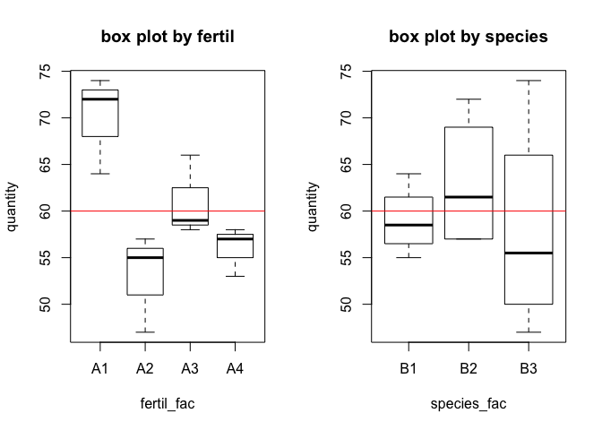

Two Way ANOVA
================

Data Generate
-------------

#### - Species: 밀의 품종

#### - Fertilizer: 비료의 종류

#### - Quantity: 밀 수확량

##### 분석 목적: 밀 수확량(y)에 유의미한 영향 미치는 요인은 어떤 것인가

``` r
species <- c('B1','B1','B1','B1','B2','B2','B2','B2','B3','B3','B3','B3')
species_fac <- as.factor(c(rep(species))) 
fertil <- c('A1','A2','A3','A4')
fertil_fac <- as.factor(c(rep(fertil,3)))

quantity <- c(64,55,59,58,72,57,66,57,74,47,58,53)
```

``` r
harvest_df <- data.frame(species_fac,fertil_fac,quantity)
harvest_df
```

    ##    species_fac fertil_fac quantity
    ## 1           B1         A1       64
    ## 2           B1         A2       55
    ## 3           B1         A3       59
    ## 4           B1         A4       58
    ## 5           B2         A1       72
    ## 6           B2         A2       57
    ## 7           B2         A3       66
    ## 8           B2         A4       57
    ## 9           B3         A1       74
    ## 10          B3         A2       47
    ## 11          B3         A3       58
    ## 12          B3         A4       53

Box plot
--------

``` r
par(mfrow=c(1,2))
plot(quantity ~ fertil_fac, main='box plot by fertil')
abline(h=mean(quantity), col='red')
plot(quantity ~ species_fac, main='box plot by species')
abline(h=mean(quantity), col='red')
```



Model fitting
-------------

``` r
anova_1 <- aov(quantity ~ fertil_fac + species_fac)
```

Result
------

``` r
summary(anova_1)
```

    ##             Df Sum Sq Mean Sq F value Pr(>F)  
    ## fertil_fac   3    498     166   9.222 0.0115 *
    ## species_fac  2     56      28   1.556 0.2856  
    ## Residuals    6    108      18                 
    ## ---
    ## Signif. codes:  0 '***' 0.001 '**' 0.01 '*' 0.05 '.' 0.1 ' ' 1

#### Fertilizer(비료)의 종류에 따라 밀 수확량에 유의미한 차이 난다는 걸 알 수 있다
