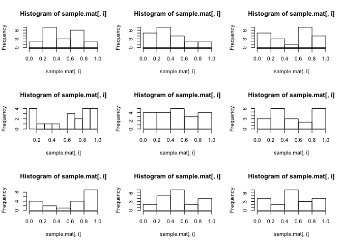
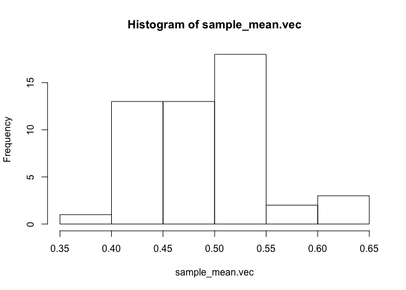
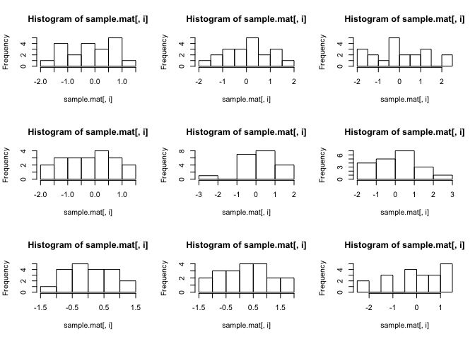
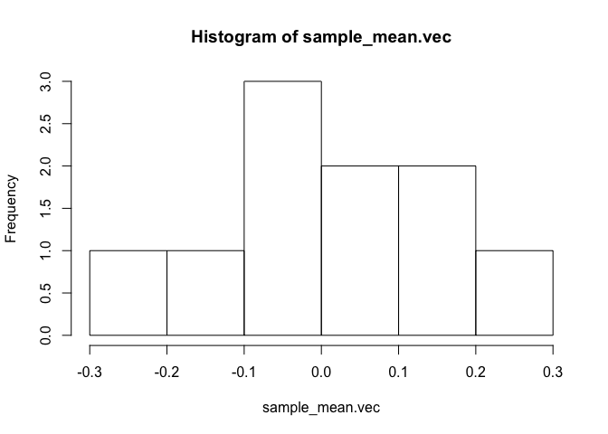
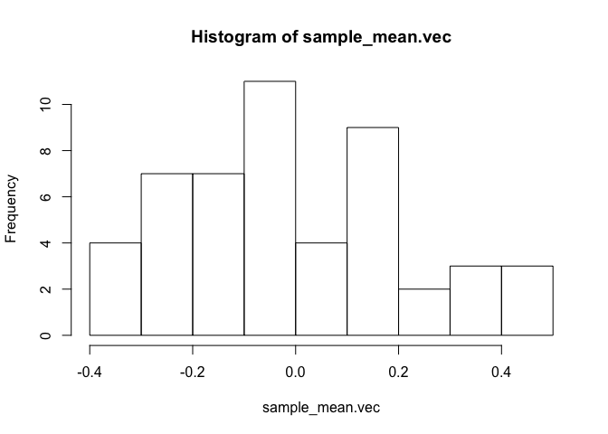

Central Limit Theorem
================

------------------------------------------------------------------------

Description: 모집단 분포가 1) Uniform-dist 2) Normal-dist 일 때 sample size n과 시행횟수가 커짐에 따라 표본 평균 $\\Bar{X}$의 분포의 형태가 정규분포에 가까워짐을 보인다.

### 모집단 분포: Uniform

``` r
pop.vec = seq(from=0, to=1, length.out=20)
hist(pop.vec, main="Histogram of Uniform distribution")
```


``` r
sample.mat = NULL
sample_mean.vec = NULL
for (i in 1:10){
  sample = runif(20,min=0,max=1)
  sample.mat = cbind(sample.mat, sample)
  sample_mean.vec = c(sample_mean.vec,mean(sample))
}
```

### 표본 분포

``` r
par(mfrow=c(3,3))
for (i in 1:9) hist(sample.mat[,i])
```

 <br><br><br>
<center>
$\\LARGE \\bar{X}$의 분포
</center>
<br>

#### n = 20, 시행횟수 = 10

``` r
par(mfrow=c(1,1))
hist(sample_mean.vec)
```


``` r
sample.mat = NULL
sample_mean.vec = NULL
for (i in 1:50){
  sample = runif(20,min=0,max=1)
  sample.mat = cbind(sample.mat, sample)
  sample_mean.vec = c(sample_mean.vec,mean(sample))
}
```

#### n = 20, 시행횟수 = 50

``` r
hist(sample_mean.vec)
```



``` r
sample.mat = NULL
sample_mean.vec = NULL
for (i in 1:1000){
  sample = runif(20,min=0,max=1)
  sample.mat = cbind(sample.mat, sample)
  sample_mean.vec = c(sample_mean.vec,mean(sample))
}
```

#### n = 20, 시행횟수 = 1000

``` r
hist(sample_mean.vec)
```


### 모집단 분포: 표준정규분포

``` r
x.vec = seq(-4,4,.01)
x_density = dnorm(x.vec,0,1)
plot(x.vec, x_density, col='darkgreen', xlab='',ylab='Density',
     type='l',lwd=2,cex=2, main="PDF of Standard Normal")
```


``` r
sample.mat = NULL
sample_mean.vec = NULL
for (i in 1:10){
  sample = rnorm(20,mean=0,sd=1)
  sample.mat = cbind(sample.mat, sample)
  sample_mean.vec = c(sample_mean.vec,mean(sample))
}
```

### 표본 분포

``` r
par(mfrow=c(3,3))
for (i in 1:9) hist(sample.mat[,i])
```

 <br><br><br>
<center>
$\\LARGE \\bar{X}$의 분포
</center>
<br>

#### n = 20, 시행횟수 = 10

``` r
par(mfrow=c(1,1))
hist(sample_mean.vec)
```



``` r
sample.mat = NULL
sample_mean.vec = NULL
for (i in 1:50){
  sample = rnorm(20,mean=0,sd=1)
  sample.mat = cbind(sample.mat, sample)
  sample_mean.vec = c(sample_mean.vec,mean(sample))
}
```

#### n = 20, 시행횟수 = 50

``` r
hist(sample_mean.vec)
```



``` r
sample.mat = NULL
sample_mean.vec = NULL
for (i in 1:1000){
  sample = rnorm(20,mean=0,sd=1)
  sample.mat = cbind(sample.mat, sample)
  sample_mean.vec = c(sample_mean.vec,mean(sample))
}
```

#### n = 20, 시행횟수 = 1000

``` r
hist(sample_mean.vec)
```


