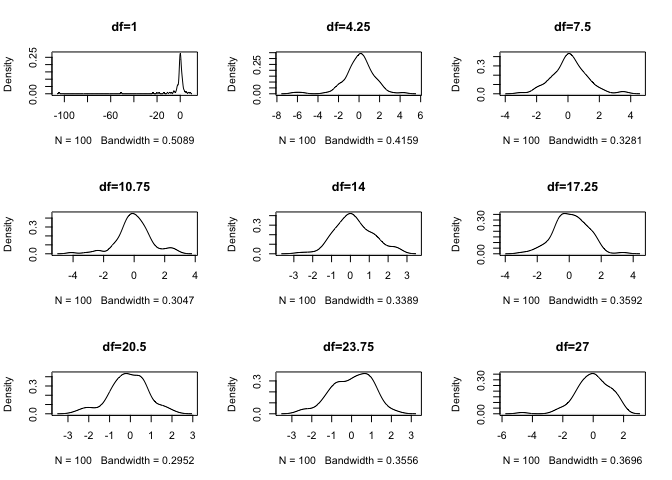
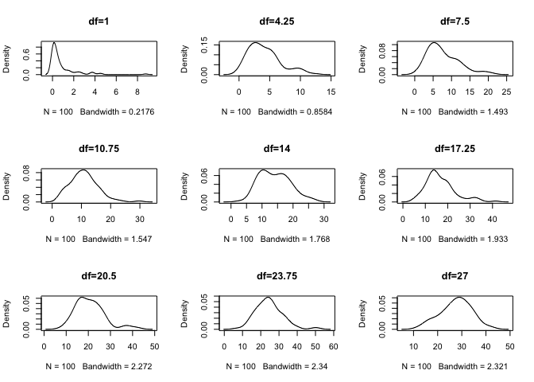
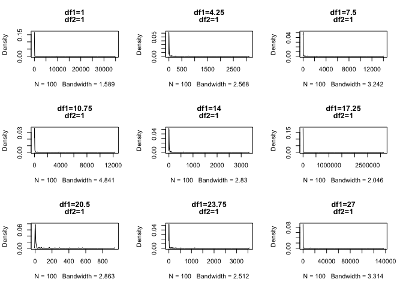
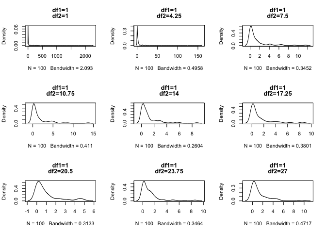
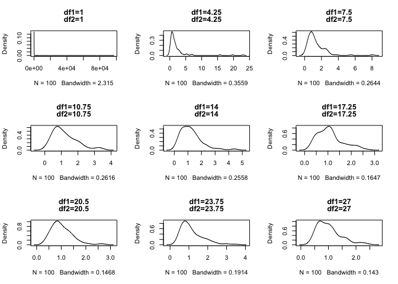

Sampling Distribution
================

------------------------------------------------------------------------

Description: T-dist, Chi-dist, F-dist의 자유도 변화에 따른 형태 확인

### T distribution

``` r
df.vec = seq(1,27,length.out = 9)
par(mfrow=c(3,3))
for (i in 1:9) {
  plot(density(rt(100,df=df.vec[i])),
       main = sprintf("df=%s",df.vec[i])
       )
}
```



### Chi-Squre distribution

``` r
df.vec = seq(1,27,length.out=9)
par(mfrow=c(3,3))
for (i in 1:9) {
  plot(density(rchisq(100,df=df.vec[i])),
       main = sprintf("df=%s",df.vec[i]))
}
```



### F distribution

``` r
df1.vec = seq(1,27,length.out=9)
df2.vec = seq(1,27,length.out=9)
par(mfrow=c(3,3))
for (i in 1:9) {
  plot(density(rf(100,df1=df1.vec[i],df2=df2.vec[1])),
       main = c(sprintf("df1=%s",df1.vec[i]), sprintf("df2=%s",df2.vec[1])))
}
```



``` r
par(mfrow=c(3,3))
for (i in 1:9) {
  plot(density(rf(100,df1=df1.vec[1],df2=df2.vec[i])),
       main = c(sprintf("df1=%s",df1.vec[1]), sprintf("df2=%s",df2.vec[i])))
}
```



``` r
par(mfrow=c(3,3))
for (i in 1:9) {
  plot(density(rf(100,df1=df1.vec[i],df2=df2.vec[i])),
       main = c(sprintf("df1=%s",df1.vec[i]), sprintf("df2=%s",df2.vec[i])))
}
```


