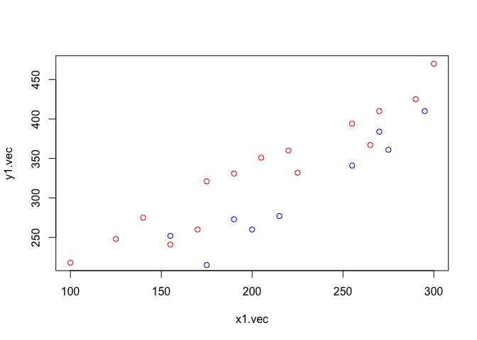
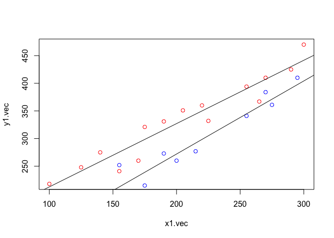
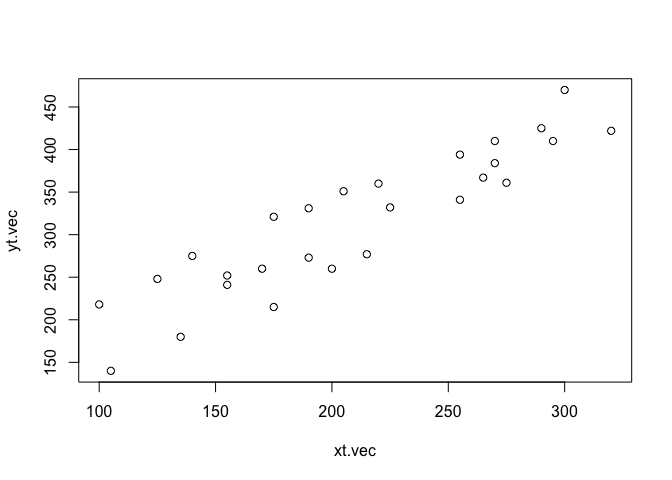
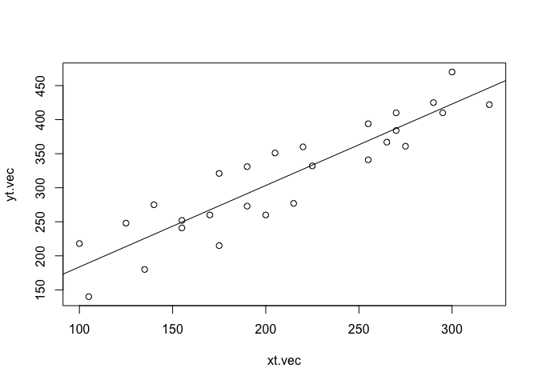
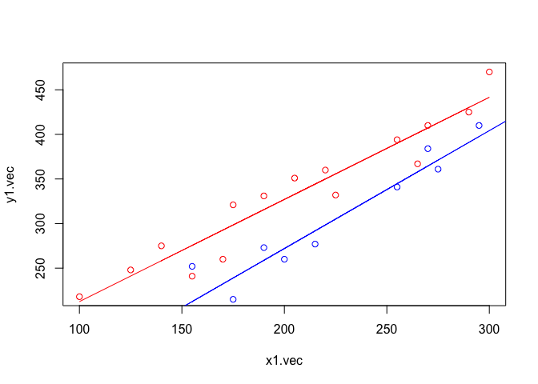
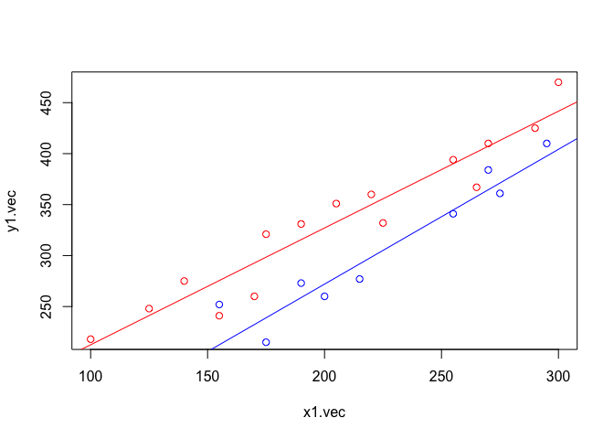

Compare Two Populations
================

#### Data Generate(F)

``` r
x1.vec = c(100,125,220,205,300,255,225,175,270,170,155,190,140,290,265)
y1.vec = c(218,248,360,351,470,394,332,321,410,260,241,331,275,425,367)
x2.vec = c(105,215,270,255,175,135,200,275,155,320,190,295)
y2.vec = c(140,277,384,341,215,180,260,361,252,422,273,410)

plot(x1.vec,y1.vec, col='red')
points(x2.vec,y2.vec, col='blue')
```



#### Model Fitting(F)

``` r
fit1 = lm(y1.vec ~ x1.vec)
SSE1 = sum(fit1$residuals^2)

fit2 = lm(y2.vec ~ x2.vec)
SSE2 = sum(fit2$residuals^2)

SSE.F = SSE1 + SSE2
df.f = summary(fit1)$df[2] + summary(fit2)$df[2]
```

``` r
plot(x1.vec,y1.vec, col='red')
points(x2.vec,y2.vec, col='blue')
abline(coef(fit1))
abline(coef(fit2))
```



#### Data Generate(R)

``` r
xt.vec = c(x1.vec,x2.vec)
yt.vec = c(y1.vec,y2.vec)

plot(xt.vec,yt.vec)
```



#### Model Fitting(R)

``` r
fit.R = lm(yt.vec ~ xt.vec)
SSE.R = sum(fit.R$residuals^2)
df.r = summary(fit.R)$df[2]

plot(xt.vec,yt.vec)
abline(coef(fit.R))
```



#### Testing

``` r
F_0 = ((SSE.R-SSE.F)/(df.r-df.f))/(SSE.F/df.f)

CP = qf(0.95,df1=(df.r-df.f),df2=df.f)

F_0 > CP
```

    ## [1] TRUE

##### =&gt; 두 회귀직선은 같지 않다!

##### =&gt; 두 모집단을 분리해서 모델 적합해야한다!!

Design Matrix 변환으로 한번에 추정하자!
---------------------------------------

``` r
x1.mat = cbind(1,0,x1.vec,0)
x2.mat = cbind(0,1,0,x2.vec)

x.mat = rbind(x1.mat,x2.mat)
y.vec = c(y1.vec,y2.vec)

colnames(x.mat) = c("x1.b0",'x2.b0','x1.b1','x2.b2')
x.mat
```

    ##       x1.b0 x2.b0 x1.b1 x2.b2
    ##  [1,]     1     0   100     0
    ##  [2,]     1     0   125     0
    ##  [3,]     1     0   220     0
    ##  [4,]     1     0   205     0
    ##  [5,]     1     0   300     0
    ##  [6,]     1     0   255     0
    ##  [7,]     1     0   225     0
    ##  [8,]     1     0   175     0
    ##  [9,]     1     0   270     0
    ## [10,]     1     0   170     0
    ## [11,]     1     0   155     0
    ## [12,]     1     0   190     0
    ## [13,]     1     0   140     0
    ## [14,]     1     0   290     0
    ## [15,]     1     0   265     0
    ## [16,]     0     1     0   105
    ## [17,]     0     1     0   215
    ## [18,]     0     1     0   270
    ## [19,]     0     1     0   255
    ## [20,]     0     1     0   175
    ## [21,]     0     1     0   135
    ## [22,]     0     1     0   200
    ## [23,]     0     1     0   275
    ## [24,]     0     1     0   155
    ## [25,]     0     1     0   320
    ## [26,]     0     1     0   190
    ## [27,]     0     1     0   295

``` r
fit = lm(y.vec~x.mat-1)
coef = fit$coefficients
coef1 = coef[c(1,3)]
coef2 = coef[c(2,4)]
```

``` r
print(coef)
```

    ## x.matx1.b0 x.matx2.b0 x.matx1.b1 x.matx2.b2 
    ##  97.965328   7.574465   1.145387   1.322049

``` r
print(coef1)
```

    ## x.matx1.b0 x.matx1.b1 
    ##  97.965328   1.145387

``` r
print(coef2)
```

    ## x.matx2.b0 x.matx2.b2 
    ##   7.574465   1.322049

``` r
y1.hat = coef[1] + x1.vec*coef1[2]
y2.hat = coef2[1] + x2.vec*coef2[2]
```

``` r
plot(x1.vec,y1.vec, col='red')
points(x2.vec,y2.vec, col='blue')
points(x1.vec,y1.hat, col="red",type='l')
points(x2.vec,y2.hat, col="blue",type='l')
```



### 기존과 비교!

``` r
plot(x1.vec,y1.vec, col='red')
points(x2.vec,y2.vec, col='blue')
abline(coef(fit1),col='red')
abline(coef(fit2),col='blue')
```



``` r
print(fit1$coefficients)
```

    ## (Intercept)      x1.vec 
    ##   97.965328    1.145387

``` r
print(fit2$coefficients)
```

    ## (Intercept)      x2.vec 
    ##    7.574465    1.322049

``` r
print(coef1)
```

    ## x.matx1.b0 x.matx1.b1 
    ##  97.965328   1.145387

``` r
print(coef2)
```

    ## x.matx2.b0 x.matx2.b2 
    ##   7.574465   1.322049

``` r
SSE.F
```

    ## [1] 9904.057

``` r
sum(fit$residuals^2)
```

    ## [1] 9904.057
