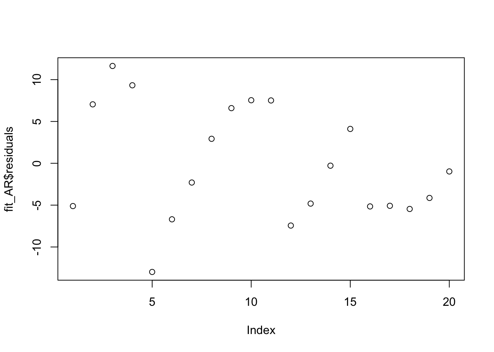

<!-- README.md is generated from README.Rmd. Please edit that file -->
### Prerequisites

``` r
library(CVTuningCov); library(orcutt);library(astsa); library(car)
## Loading required package: lmtest
## Loading required package: zoo
## 
## Attaching package: 'zoo'
## The following objects are masked from 'package:base':
## 
##     as.Date, as.Date.numeric
## Loading required package: carData
```

### Generate auto-correlated Data

``` r
y.vec = c(349.7,353.5,359.2,366.4,376.5,385.7,391.3,398.9,404.2,414.0,423.4,430.5,
          440.4,451.8,457.0,460.9,462.9,443.4,445.0,449.0)
x.vec = c(133.6,135.4,137.6,140.0,143.8,147.1,148.8,151.4,153.3,156.5,160.8,163.6,
          166.9,171.4,174.0,175.4,180.5,184.9,187.1,188.7)
```

### Fit OLS

``` r
fit = lm(y.vec ~ x.vec)
```

``` r
summary(fit)
## 
## Call:
## lm(formula = y.vec ~ x.vec)
## 
## Residuals:
##     Min      1Q  Median      3Q     Max 
## -22.959  -8.874   2.035   9.035  16.623 
## 
## Coefficients:
##             Estimate Std. Error t value Pr(>|t|)    
## (Intercept)   89.234     26.721   3.339  0.00365 ** 
## x.vec          2.024      0.166  12.196 3.89e-10 ***
## ---
## Signif. codes:  0 '***' 0.001 '**' 0.01 '*' 0.05 '.' 0.1 ' ' 1
## 
## Residual standard error: 12.98 on 18 degrees of freedom
## Multiple R-squared:  0.892,  Adjusted R-squared:  0.886 
## F-statistic: 148.7 on 1 and 18 DF,  p-value: 3.888e-10
```

### Plotting Residuals

``` r
fit_residual = fit\\hat{\\rho}\\hat{V}\\hat{\\beta\_{GLS}}values)
C = eigen(V_hat)residuals)
```


