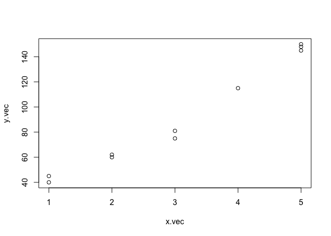
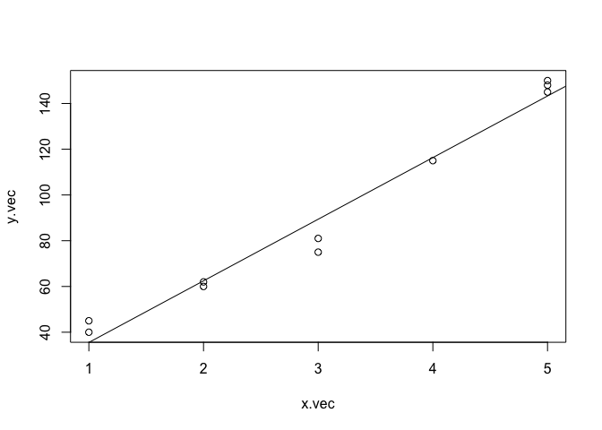
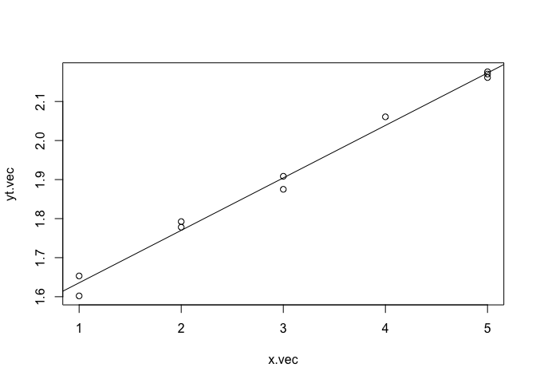
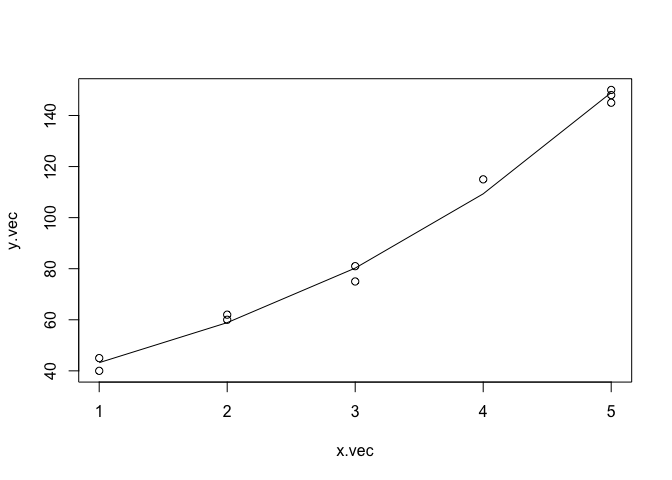
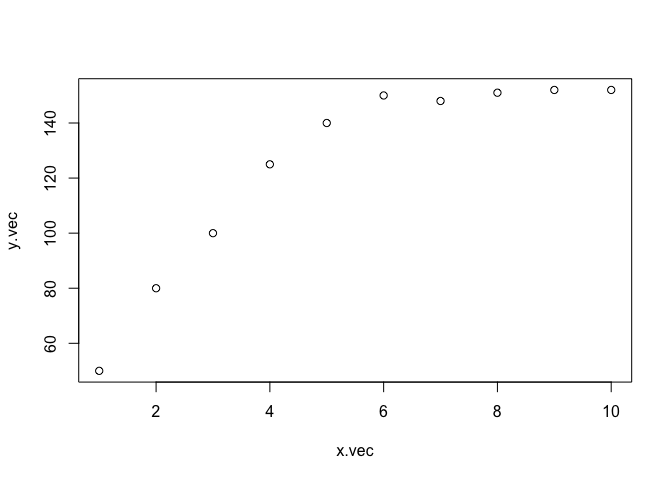
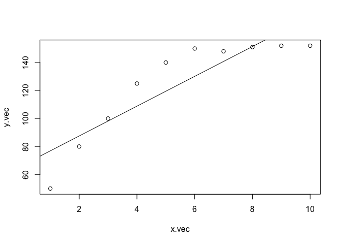
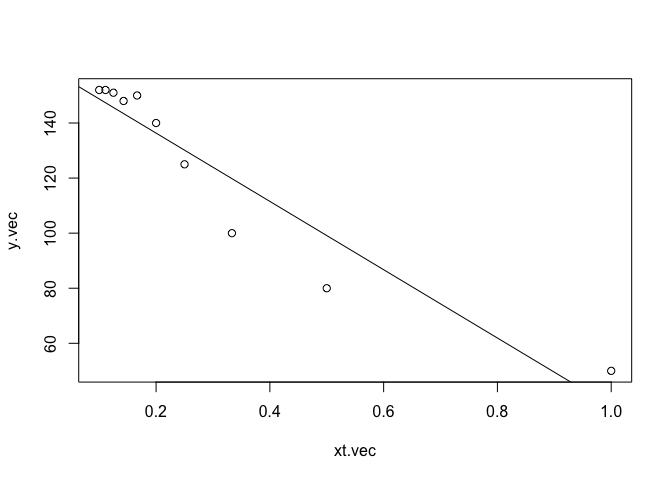

Model Transformation
================

When the model is non-linear equation
-------------------------------------

Data Generate
-------------

``` r
x.vec = c(1,1,2,2,3,3,4,5,5,5)
y.vec = c(45,40,60,62,75,81,115,150,145,148)
```

``` r
plot(x.vec,y.vec)
```



#### OLS

``` r
fit = lm(y.vec ~ x.vec)
plot(x.vec,y.vec)
abline(coef(fit))
```



#### 혹시 *y* = *a*<sub>0</sub>*a*<sub>1</sub><sup>*x*</sup> 꼴이 True 모형 아닐까?

#### 그럼 양변에 로그를 취한 모형을 만들어보자!

#### *l**o**g**y* = *l**o**g**a*<sub>0</sub> + *l**o**g**a*<sub>1</sub>*x* + *l**o**g**ϵ*

##### 이 모형이 True 모형이라고 생각하면 *l**o**g**y*는 x의 linear combination

``` r
yt.vec = log10(y.vec)
fit.t = lm(yt.vec ~ x.vec)
plot(x.vec,yt.vec)
abline(coef(fit.t))
```



#### 두 모형의 *R*<sup>2</sup>비교

``` r
summary(fit)$adj.r.squared
```

    ## [1] 0.9692943

``` r
summary(fit.t)$adj.r.squared
```

    ## [1] 0.9905129

##### Transformation한 모형의 *R*<sup>2</sup>가 더 높다!

#### True 모형으로 돌아가 적합해보면

``` r
y.hat = (10^coef(fit.t)[1])*(10^coef(fit.t)[2])^(x.vec)
plot(x.vec,y.vec)+
points(x.vec,y.hat,type='l')
```



    ## integer(0)

##### True 모형이

##### $y=\\beta\_{0}+\\beta\_{1}({1\\over x})+\\epsilon$ 이라면??

``` r
x.vec = c(1,2,3,4,5,6,7,8,9,10)
y.vec = c(50,80,100,125,140,150,148,151,152,152)
plot(x.vec,y.vec)
```



``` r
fit1 = lm(y.vec ~ x.vec)
plot(x.vec,y.vec)
abline(coef(fit1))
```



### Transformation

##### *x*<sup>′</sup> = 1/*x*

``` r
xt.vec = 1/x.vec
plot(xt.vec,y.vec)
fit2 = lm(y.vec~ xt.vec)
abline(coef(fit2))
```



``` r
summary(fit1)$adj.r.squared
```

    ## [1] 0.7667892

``` r
summary(fit2)$adj.r.squared
```

    ## [1] 0.8915449
